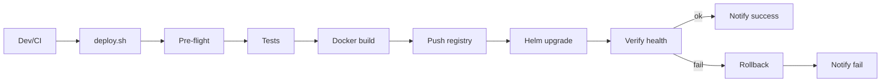

# BUILD-32 — deploy.sh Deployment Script

> Source: [https://notion.so/3ac8d4785c2245e0a30733c7455a10ad](https://notion.so/3ac8d4785c2245e0a30733c7455a10ad)
> Created: 2026-04-20T11:38:00.000Z | Last edited: 2026-04-20T22:49:00.000Z


---
> **ℹ **Tier 5 · Application · Priority: HIGH****

  One-command deployment script for NeuroLoom. Handles Docker build, push, Helm upgrade, health verification, and rollback — for staging and production environments.

## Purpose

`deploy.sh` is the **single entry point for all deployments**. It orchestrates the full pipeline: build → test → push → deploy → verify → rollback-if-failed. It replaces manual kubectl/helm commands and ensures consistent, auditable deployments.

## Dependencies

- **BUILD-28 (K8s Backend)** — Dockerfile and Helm charts
- Tools: Docker, Helm 3, kubectl, jq, curl
## File Structure

```javascript
scripts/
├── deploy.sh                 # Main deployment script
├── rollback.sh               # Emergency rollback
├── lib/
│   ├── colors.sh             # Terminal color helpers
│   ├── logging.sh            # Structured logging
│   ├── docker.sh             # Docker build/push functions
│   ├── helm.sh               # Helm upgrade/rollback functions
│   ├── health.sh             # Health check verification
│   └── notify.sh             # Slack/webhook notifications
├── config/
│   ├── staging.env           # Staging environment vars
│   └── production.env        # Production environment vars
└── __tests__/
    └── deploy.bats           # Bats testing framework
```

## Interface (CLI Arguments)

```bash
# Usage
./deploy.sh <environment> [options]

# Environments
#   staging     - Deploy to staging cluster
#   production  - Deploy to production cluster (requires --confirm)

# Options
#   --tag <tag>         Docker image tag (default: git SHA)
#   --skip-build        Skip Docker build (use existing image)
#   --skip-tests        Skip pre-deploy test suite
#   --dry-run           Show what would happen without executing
#   --confirm           Required for production deployments
#   --rollback-on-fail  Auto-rollback if health checks fail (default: true)
#   --timeout <sec>     Health check timeout (default: 300)
#   --notify            Send Slack notification on complete/fail
```

## Key Variables

```bash
# Configuration
REGISTRY="ghcr.io/neuroloom"
IMAGE_NAME="neuroloom-backend"
HELM_CHART="./infra/helm/neuroloom"
HELM_RELEASE="neuroloom"
K8S_NAMESPACE="neuroloom"

# Per-environment
STAGING_CONTEXT="gke_neuroloom_us-central1_staging"
PRODUCTION_CONTEXT="gke_neuroloom_us-central1_production"
STAGING_VALUES="./infra/helm/neuroloom/values.staging.yaml"
PRODUCTION_VALUES="./infra/helm/neuroloom/values.prod.yaml"

# Safety
MAX_UNAVAILABLE_PERCENT=25
HEALTH_CHECK_RETRIES=30
HEALTH_CHECK_INTERVAL=10
ROLLBACK_TIMEOUT=120
```

## Implementation SOP

### Step 1: Implement `lib/` helper functions

- `colors.sh`: `info()`, `warn()`, `error()`, `success()` with ANSI colors
- `logging.sh`: Timestamped log with level, write to stdout AND `deploy.log`
- `docker.sh`: `docker_build()`, `docker_push()`, `docker_tag()`
- `helm.sh`: `helm_upgrade()`, `helm_rollback()`, `helm_status()`
- `health.sh`: `wait_for_healthy()` — poll /ready endpoint until success or timeout
- `notify.sh`: `send_slack()` — webhook notification with deployment details
### Step 2: Implement main `deploy.sh` pipeline

1. **Parse arguments** — validate environment, set context
1. **Pre-flight checks** — docker, helm, kubectl available? Cluster reachable? Auth valid?
1. **Run tests** (unless --skip-tests) — `npm test` must pass
1. **Build Docker image** — multi-stage build with cache
1. **Push to registry** — tag with git SHA + environment
1. **Helm upgrade** — `helm upgrade --install --wait --timeout 5m`
1. **Health verification** — poll /ready every 10s for 5 minutes
1. **Success notification** — Slack webhook with deployment summary
1. **On failure** — auto-rollback to previous revision, alert
### Step 3: Production safety gates

- `--confirm` flag REQUIRED for production
- Interactive prompt: "Deploy <tag> to PRODUCTION? Type 'yes' to confirm"
- Check: no pending rollbacks, staging deployed first (tag exists in staging)
- ⚠️ **Gotcha:** NEVER allow --skip-tests for production
### Step 4: Implement `rollback.sh`

- `./rollback.sh <environment> [revision]`
- If no revision specified: roll back to previous
- `helm rollback $RELEASE $REVISION --wait --timeout 2m`
- Verify health after rollback
### Step 5: Environment configs

- `staging.env`: Lower resource limits, debug logging, test data allowed
- `production.env`: Full resources, info logging, strict security
- Source the correct `.env` based on environment argument
## Gotchas & Warnings

⚠️ NEVER store secrets in env files — use external-secrets-operator

⚠️ Production requires explicit --confirm — no accident deployments

⚠️ Health check timeout must exceed pod startup time (startup probe failureThreshold × periodSeconds)

⚠️ Rollback preserves PVCs — data is safe even on failed deploy

⚠️ Always deploy to staging first, verify, THEN production

## Testing Requirements

- **Unit (Bats):** Argument parsing, environment validation, dry-run output
- **Integration:** Docker build succeeds with test Dockerfile
- **Integration:** Helm template renders without errors
- **E2E:** Full deploy to kind cluster, verify health, rollback
## Acceptance Criteria

- [ ] [deploy.sh](http://deploy.sh/) deploys to staging with one command
- [ ] Production requires --confirm flag
- [ ] Health checks verify deployment success
- [ ] Auto-rollback on health check failure
- [ ] Slack notifications on success/failure
- [ ] Dry-run mode shows plan without executing
- [ ] All tests pass with `vitest run`
- [ ] Full staging deploy completes in ≤ 8 min including health verify
- [ ] Auto-rollback returns to previous revision within 2 min on health fail
- [ ] Production deploy refuses without `--confirm`
## Architecture



## Stage Gates

*[table: 3 columns]*

## Reference — Health Poll

```bash
wait_for_healthy() {
	local url="$1"; local retries="${2:-30}"; local interval="${3:-10}"
	for i in $(seq 1 "$retries"); do
		if curl -fsS "$url/ready" | jq -e '.ready == true' >/dev/null; then
			info "ready after ${i} checks"
			return 0
		fi
		sleep "$interval"
	done
	error "not ready after $((retries * interval))s"
	return 1
}
```

## Observability

- Writes `deploy.log` with timestamped structured entries.
- Emits deployment annotation to Grafana (dashboard cross-reference).
- Slack webhook: env, tag, duration, success/fail, link to logs.
- Tags K8s deployment with `app.kubernetes.io/revision` = git SHA.
## Security

- Requires kubeconfig context matching environment (enforced check).
- Registry auth via short-lived OIDC token in CI.
- Production path is gated by `--confirm` and prompt.
- `deploy.log` redacts tokens; log rotated to S3 cold store.
## Failure Modes

*[table: 3 columns]*

## Operational Runbook

1. **Staging:** `./scripts/deploy.sh staging --tag v1.2.3`.
1. **Prod:** `./scripts/deploy.sh production --tag v1.2.3 --confirm`.
1. **Rollback:** `./scripts/rollback.sh production` (last good revision).
1. **Dry-run:** append `--dry-run` to preview plan.
## Integration

- **BUILD-28 (K8s Backend):** deployment target.
- **BUILD-31 (CLI):** `neuroloom deploy` can call [deploy.sh](http://deploy.sh/) under the hood.
- **BUILD-27 (Fortress):** red level pauses automated deploys.
## FAQ

> **Can I deploy manually with helm?** Yes, but skips safety gates and audit. Not recommended.

> **What if both staging and prod are on the same tag?** Allowed; we track promotion via annotations.

## Changelog

- v0.1.0 — full pipeline, rollback, Slack, dry-run
- v0.2.0 (planned) — canary rollout support
- v0.3.0 (planned) — progressive delivery via Argo Rollouts

