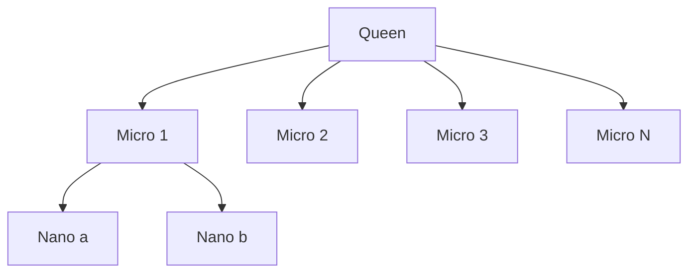

# BUILD-56 — Scale Tier: Meso

> Source: [https://notion.so/ad5db45da16341d89214c68aed363565](https://notion.so/ad5db45da16341d89214c68aed363565)
> Created: 2026-04-20T18:19:00.000Z | Last edited: 2026-04-20T20:09:00.000Z


---
> **ℹ **Tier 12 · Topology · Scale: MESO (10³–10⁵ agents) · Priority: HIGH****

  Meso-scale swarm topology: the *organizational* unit. A Meso Swarm is a swarm-of-swarms (typically 10–10,000 teams) unified by a Queen, coordinated by Multi-Swarm, and addressed by Conductor.

## Fold Provenance

*[table: 2 columns]*

## Purpose

Meso is the default scale for a NeuroLoom *deployment* — one tenant, one regional cluster, or one product line. Meso swarms are bounded by blast radius (single Fortress policy domain) and budget (single CRC envelope).

## Dependencies

- **BUILD-08, BUILD-13, BUILD-59** (ancestors)
- **BUILD-67 (Micro Swarm)** — constituent
- **BUILD-47 (CRC)** — budget
- **BUILD-27 (Fortress)** — policy envelope
## File Structure

```javascript
crates/meso-topology/
├── src/
│   ├── shape/
│   │   ├── hierarchy.rs     # sub-swarm tree
│   │   └── registry.rs
│   ├── govern/
│   │   ├── policy.rs        # Fortress binding
│   │   └── budget.rs        # CRC binding
│   ├── fold/
│   │   ├── address.rs
│   │   └── gossip.rs
│   └── types.rs
```

## Interfaces & Types

```rust
pub struct MesoSwarm {
    pub id: SwarmId,
    pub queen: AgentId,
    pub sub_swarms: Vec<MicroSwarmId>,
    pub policy_domain: PolicyDomainId,
    pub budget_envelope: BudgetId,
    pub agent_count: u64,
}

pub struct MesoConfig {
    pub min_agents: u64,
    pub max_agents: u64,            // default 100_000
    pub fanout: u32,                // default 16 sub-swarms
    pub liveness_ms: u32,
}
```

## Implementation SOP

### Step 1: Shape (`shape/hierarchy.rs`)

- Meso owns a tree of Micro sub-swarms (fan-out = 16 by default)
- Registry maps Micro → Meso binding
### Step 2: Govern

- Single Fortress domain
- Single CRC envelope split proportionally across Micros
### Step 3: Gossip (`fold/gossip.rs`)

- Heartbeat HLC every 1 s
- Membership CRDT (add/remove sub-swarms)
- Topology changes propagate in ≤ 5 s
## Acceptance Criteria

- [ ] Hierarchy enforced (Meso → Micros → Nanos)
- [ ] Budget split honored
- [ ] Policy domain enforced globally
- [ ] Gossip converges ≤ 5 s at 10⁵ scale
- [ ] All tests pass with `vitest run`
- [ ] Cross-Micro command dispatch ≤ 5 ms P99
- [ ] Queen failover ≤ 30 s
## Architecture



## Scale Matrix

*[table: 3 columns]*

## Extended Types

```rust
pub struct MembershipEvent { pub at: HLCTimestamp, pub kind: MembershipKind, pub swarm: SwarmId }
pub enum MembershipKind { Join, Leave, Promote, Demote }
```

## Reference — Bootstrap

```rust
pub async fn bootstrap(cfg: MesoConfig) -> Result<MesoSwarm> {
    let queen = queen::spawn().await?;
    let micros = (0..cfg.fanout).map(|i| micro::spawn(queen.id, i)).collect::<Vec<_>>();
    let micros = join_all(micros).await.into_iter().collect::<Result<Vec<_>>>()?;
    Ok(MesoSwarm { id: SwarmId::new(), queen: queen.id, sub_swarms: micros, policy_domain: PolicyDomainId::default(), budget_envelope: BudgetId::default(), agent_count: 0 })
}
```

## Observability

- `meso.agents.count` gauge
- `meso.gossip.convergence_ms` histogram
- `meso.dispatch.latency_ms` histogram
- `meso.budget.used_pct` gauge
## Security

- One Fortress domain per Meso; no cross-Meso silent traffic
- Queen-signed membership events
- Replay-protected gossip
## Failure Modes

*[table: 3 columns]*

## Operational Runbook

1. **Bootstrap:** `meso bootstrap --fanout 16`.
1. **Inspect:** `meso ls`.
1. **Resize:** `meso resize --sub-swarms 32`.
## Integration

- Contains Micro sub-swarms (BUILD-67)
- Reports up to cross-Meso federation (future)
## FAQ

> **Can a Meso span regions?** No — cross-region is federation, not topology.

> **How many Meso per tenant?** Typical 1–4.

## Changelog

- v0.1.0 — hierarchy, gossip, budget, policy
- v0.2.0 (planned) — elastic fanout
- v0.3.0 (planned) — predictive resizing

