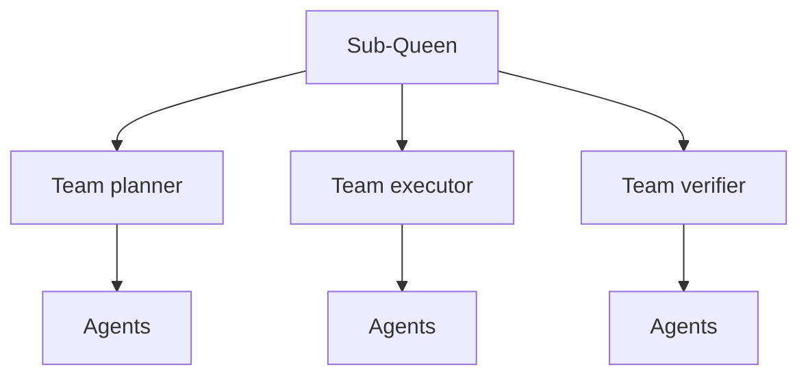

# BUILD-57 — Scale Tier: Micro

> Source: [https://notion.so/6985b799462745f8ac851e19e7d8ed58](https://notion.so/6985b799462745f8ac851e19e7d8ed58)
> Created: 2026-04-20T18:19:00.000Z | Last edited: 2026-04-20T20:09:00.000Z


---
> **ℹ **Tier 12 · Topology · Scale: MICRO (10¹–10³ agents) · Priority: HIGH****

  Micro-scale swarm: the *work unit*. A Micro swarm is typically 10–1000 agents organized into teams, with a local sub-queen and a single task domain.

## Fold Provenance

*[table: 2 columns]*

## Purpose

Micro is where *work* lives. A Micro swarm owns a task domain (e.g., retrieval, reasoning, code synthesis) and allocates it across teams of agents. Parent Meso decides what a Micro works on; Micro decides how.

## Dependencies

- **BUILD-72, BUILD-59, BUILD-08** (ancestors)
- **BUILD-66 (Meso)** — parent
- **BUILD-68 (Nano)** — may contain
- **BUILD-69 (Agent)** — constituent
## File Structure

```javascript
crates/micro-topology/
├── src/
│   ├── teams/
│   │   ├── roster.rs
│   │   └── assign.rs
│   ├── local/
│   │   ├── sub_queen.rs
│   │   └── scheduler.rs
│   ├── fold/
│   │   ├── domain.rs
│   │   └── work_unit.rs
│   └── types.rs
```

## Interfaces & Types

```rust
pub struct MicroSwarm {
    pub id: MicroSwarmId,
    pub parent: MesoSwarmId,
    pub sub_queen: AgentId,
    pub teams: Vec<TeamId>,
    pub task_domain: String,
    pub agent_count: u32,
}

pub struct WorkUnit {
    pub id: Uuid,
    pub kind: String,
    pub payload: Vec<u8>,
    pub deadline: HLCTimestamp,
    pub assigned_team: Option<TeamId>,
}
```

## Implementation SOP

### Step 1: Teams

- Spawn N teams (default 4–16) per Micro
- Each team owns a role (planner, executor, verifier, scribe)
### Step 2: Scheduler

- Local sub-queen schedules WorkUnits to teams
- Deadline-aware; back-pressure from teams
### Step 3: Domain

- Single task domain per Micro (composable, not nested)
- Cross-domain work escalates to Meso
## Acceptance Criteria

- [ ] Team composition respected
- [ ] Scheduler deadline-honoring
- [ ] Task domain enforced
- [ ] Back-pressure propagates to Meso
- [ ] Sub-queen failover ≤ 10 s
- [ ] All tests pass with `vitest run`
- [ ] Work unit dispatch P99 ≤ 2 ms
- [ ] Scale to 1000 agents sustained
## Architecture



## Role Archetypes

*[table: 3 columns]*

## Extended Types

```rust
pub struct BackPressure { pub queue_depth: u32, pub rejection_rate: f32 }
pub struct DomainContract { pub inputs: Vec<String>, pub outputs: Vec<String>, pub invariants: Vec<String> }
```

## Reference — Schedule

```rust
pub async fn schedule(mu: &MicroSwarm, unit: WorkUnit) -> Result<TeamId> {
    let team = scheduler::pick(mu, &unit).await?;
    assign::post(team, unit).await?;
    Ok(team)
}
```

## Observability

- `micro.queue.depth` gauge per team
- `micro.work.latency_ms` histogram
- `micro.rejection_total` counter
## Security

- Inherits Meso policy domain
- Teams can only see WorkUnits for their role
- Cross-team leaks audited
## Failure Modes

*[table: 3 columns]*

## Operational Runbook

1. **Spawn:** `micro spawn --parent <meso> --domain retrieval`.
1. **Scale team:** `micro team resize planner --count 2`.
1. **Trace:** `micro trace --work <uuid>`.
## Integration

- Child of Meso (BUILD-66)
- Contains Teams (BUILD-72) which contain Agents
## FAQ

> **Can I nest Micro?** No — use Nano for finer granularity.

> **Can teams span Micros?** Only via virtual aggregates in Conductor.

## Changelog

- v0.1.0 — teams, scheduler, domain
- v0.2.0 (planned) — adaptive team sizing
- v0.3.0 (planned) — domain composition

