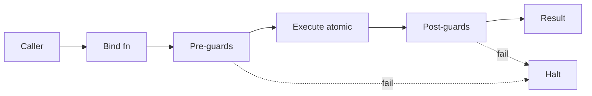

# BUILD-58 — Scale Tier: Nano

> Source: [https://notion.so/79a9f0591c514a50bb75df3fd67a9285](https://notion.so/79a9f0591c514a50bb75df3fd67a9285)
> Created: 2026-04-20T18:19:00.000Z | Last edited: 2026-04-20T20:09:00.000Z


---
> **ℹ **Tier 12 · Topology · Scale: NANO (10°–10¹ agents) · Priority: HIGH****

  Nano swarm: the *atomic* unit. Single-digit agents cooperating on a primitive task (typically one atomic function invocation with guards). Nanos compose into Micros.

## Fold Provenance

*[table: 2 columns]*

## Purpose

Nano is where atomic functions execute. A Nano swarm typically has 1–10 agents, no sub-queen (flat), and owns exactly one primitive operation end-to-end. Nanos are the unit of scheduling and the unit of restart.

## Dependencies

- **BUILD-73, BUILD-59, BUILD-75** (ancestors)
- **BUILD-67 (Micro)** — parent
- **BUILD-71 (Nano-Agent)** — constituent
## File Structure

```javascript
crates/nano-topology/
├── src/
│   ├── flat/
│   │   ├── membership.rs
│   │   └── heartbeat.rs
│   ├── atomic/
│   │   ├── bind.rs           # bind to 1 atomic fn
│   │   └── guard.rs          # pre/post conditions
│   ├── fold/
│   │   ├── grain.rs          # fine-grained execution
│   │   └── halt.rs           # <112 us halt
│   └── types.rs
```

## Interfaces & Types

```rust
pub struct NanoSwarm {
    pub id: NanoSwarmId,
    pub parent: MicroSwarmId,
    pub agents: Vec<NanoAgentId>,
    pub atomic_fn: String,
    pub state: NanoState,
}

pub enum NanoState { Idle, Bound, Running, Halted, Reaped }

pub struct GuardSet {
    pub pre: Vec<Predicate>,
    pub post: Vec<Predicate>,
    pub invariants: Vec<Predicate>,
}
```

## Implementation SOP

### Step 1: Flat membership

- No sub-queen; consensus via HLC-ordered heartbeat
- Default 3 agents (primary, shadow, verifier)
### Step 2: Bind to atomic function

- One NanoSwarm ↔ one atomic fn (BUILD-75)
- Type-checked binding
### Step 3: Guards

- Pre: inputs valid
- Post: outputs invariants hold
- Failed guard → halt + reap
### Step 4: FRACTAL_HALT

- Sub-112 μs halt on guard fail
- Shadow becomes primary
## Acceptance Criteria

- [ ] Flat membership works without sub-queen
- [ ] Atomic fn binding type-checked
- [ ] Guards enforced pre/post
- [ ] Halt latency ≤ 112 μs
- [ ] Shadow promotion atomic
- [ ] All tests pass with `vitest run`
- [ ] Throughput ≥ 10k invocations/s per Nano
- [ ] Memory footprint ≤ 10 MB per Nano
## Architecture



## State Transition Matrix

*[table: 3 columns]*

## Extended Types

```rust
pub struct Predicate { pub code: String, pub timeout_us: u32 }
pub struct ReapReceipt { pub nano: NanoSwarmId, pub reason: String, pub duration_us: u64 }
```

## Reference — Invoke

```rust
pub async fn invoke(ns: &NanoSwarm, input: Bytes) -> Result<Bytes> {
    for p in &ns.guards.pre { guard::check(p, &input).await?; }
    let out = atomic::call(&ns.atomic_fn, input).await?;
    for p in &ns.guards.post { guard::check(p, &out).await?; }
    Ok(out)
}
```

## Observability

- `nano.invocations_total`, label `atomic_fn`
- `nano.guard.fails_total` counter, label `phase`
- `nano.halt.latency_us` histogram
- `nano.state` gauge
## Security

- Guards are capability-checked
- Atomic fn binding signed
- Reap events audited
## Failure Modes

*[table: 3 columns]*

## Operational Runbook

1. **Bind:** `nano bind --fn atomic.embed --size 3`.
1. **Invoke:** `nano call --ns <id> --input <b64>`.
1. **Reap:** `nano reap --ns <id>`.
## Integration

- Child of Micro
- Binds an Atomic Function from BUILD-75
- Uses Nano-Agent runtime (BUILD-71)
## FAQ

> **Can a Nano run multiple atomic fns?** No — one Nano, one fn. Compose via Micro.

> **Why 3 agents default?** Primary + shadow + verifier is the minimum for fast failover.

## Changelog

- v0.1.0 — flat, bind, guards, halt
- v0.2.0 (planned) — SIMD-bound Nanos
- v0.3.0 (planned) — hardware-accelerated guards

