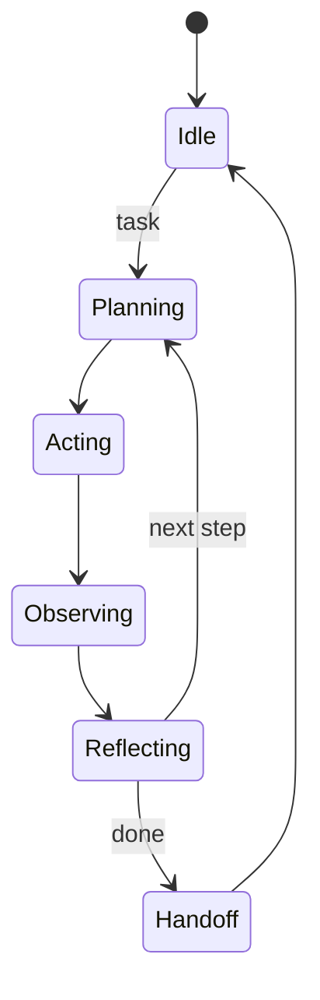

# BUILD-59 — Scale Tier: Agent

> Source: [https://notion.so/64158c949c3f420b93bf777878f464ba](https://notion.so/64158c949c3f420b93bf777878f464ba)
> Created: 2026-04-20T18:19:00.000Z | Last edited: 2026-04-20T20:09:00.000Z


---
> **ℹ **Tier 12 · Runtime · Scale: Agent · Priority: HIGH****

  Standard Agent runtime: one execution envelope per cognitive worker. Folds L6 Engine (reasoning), ASMI (meta-cognition), and Queen client (coordination) into a single addressable agent.

## Fold Provenance

*[table: 2 columns]*

## Purpose

An Agent is the canonical NeuroLoom worker: sized for complete reasoning tasks (inputs → plan → execute → verify → output) with a full ASMI loop. Agents live inside Teams inside Micros inside Mesos.

## Dependencies

- **BUILD-01, BUILD-07, BUILD-08** (ancestors)
- **BUILD-72 (Team)** — membership
- **BUILD-65 (Continuum)** — evolution
- **BUILD-61 (Phoenix Prime)** — resurrection
## File Structure

```javascript
crates/agent-runtime/
├── src/
│   ├── envelope/
│   │   ├── identity.rs
│   │   ├── memory.rs
│   │   └── tools.rs
│   ├── loop/
│   │   ├── plan.rs
│   │   ├── act.rs
│   │   ├── observe.rs
│   │   └── reflect.rs      # ASMI
│   ├── fold/
│   │   ├── full_cycle.rs
│   │   └── handoff.rs
│   └── types.rs
```

## Interfaces & Types

```rust
pub struct Agent {
    pub id: AgentId,
    pub team: TeamId,
    pub role: String,
    pub genome: Uuid,
    pub state: AgentState,
    pub memory_quota_mb: u32,
}

pub enum AgentState { Idle, Planning, Acting, Observing, Reflecting, Handoff, Dead }

pub struct Cycle {
    pub plan: Vec<Step>,
    pub actions: Vec<Action>,
    pub observations: Vec<Obs>,
    pub reflection: Reflection,
}
```

## Implementation SOP

### Step 1: Envelope

- Identity from Immortality ledger
- Private memory quota
- Tool set bound at boot
### Step 2: PAOR loop (Plan-Act-Observe-Reflect)

- Plan via L6 Engine
- Act via bound tools
- Observe outcomes
- Reflect via ASMI; update strategy
### Step 3: Handoff

- On completion → emit result to Team
- On escalation → hand to Sub-Queen
- On failure → Phoenix Prime
## Acceptance Criteria

- [ ] PAOR loop stable
- [ ] ASMI reflection changes future plans
- [ ] Memory quota honored
- [ ] Tool scope enforced
- [ ] Handoff semantics correct
- [ ] All tests pass with `vitest run`
- [ ] Cycle P99 ≤ 2 s for typical task
- [ ] Graceful death with state digest
## Architecture



## Role Library (excerpt)

*[table: 4 columns]*

## Extended Types

```rust
pub struct Reflection { pub score: f64, pub lessons: Vec<String>, pub next_plan_hint: Option<String> }
pub struct ToolBinding { pub name: String, pub scope: Scope, pub quota: u32 }
```

## Reference — Tick

```rust
pub async fn tick(a: &mut Agent) -> Result<Cycle> {
    let plan = plan::make(a).await?;
    let actions = act::run(a, &plan).await?;
    let obs = observe::collect(&actions).await?;
    let refl = reflect::asmi(a, &obs).await?;
    Ok(Cycle { plan, actions, observations: obs, reflection: refl })
}
```

## Observability

- `agent.cycle.latency_ms` histogram
- `agent.reflection.score` gauge
- `agent.memory.used_mb` gauge
- `agent.deaths_total`
## Security

- Tool scope token-gated
- Memory isolation per agent
- All handoffs signed
## Failure Modes

*[table: 3 columns]*

## Operational Runbook

1. **Spawn:** `agent spawn --role planner --team <id>`.
1. **Inspect:** `agent inspect <id>`.
1. **Retire:** `agent retire <id>`.
## Integration

- Constituent of Teams (BUILD-72)
- Can spawn Sub-Agents (BUILD-70) for delegation
## FAQ

> **Can an agent have zero tools?** Yes — pure-reasoning agents exist.

> **Are agents reentrant?** No — one active cycle at a time.

## Changelog

- v0.1.0 — envelope, PAOR loop, handoff
- v0.2.0 (planned) — batched cycles
- v0.3.0 (planned) — GPU-colocated agents

