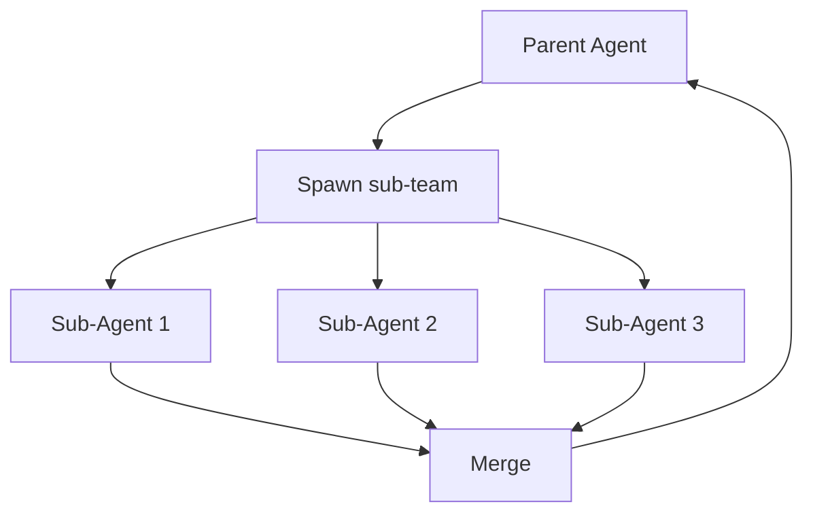

# BUILD-60 — Scale Tier: Sub-Agent

> Source: [https://notion.so/29a1093210e84de8b9347fc18b61dc99](https://notion.so/29a1093210e84de8b9347fc18b61dc99)
> Created: 2026-04-20T18:19:00.000Z | Last edited: 2026-04-20T20:09:00.000Z


---
> **ℹ **Tier 12 · Runtime · Scale: Sub-Agent · Priority: MEDIUM****

  Sub-Agents are delegated workers owned by a parent Agent. A Sub-Agent Team is a bounded pool (typically 2–8) scoped to one parent task, sharing memory and tool scope with the parent.

## Fold Provenance

*[table: 2 columns]*

## Purpose

Sub-Agents let an Agent delegate subtasks without escalating to the Team. Use them for: parallel search, recursive planning, tool-specialized helpers. Sub-Agent Teams dissolve when the parent task completes.

## Dependencies

- **BUILD-69, BUILD-59, BUILD-72** (ancestors)
- **BUILD-47 (CRC)** — budget split
## File Structure

```javascript
crates/sub-agent-teams/
├── src/
│   ├── delegate/
│   │   ├── spawn.rs
│   │   └── contract.rs
│   ├── local/
│   │   ├── scheduler.rs
│   │   └── memory.rs         # shared via parent
│   ├── fold/
│   │   ├── dissolve.rs
│   │   └── lineage.rs
│   └── types.rs
```

## Interfaces & Types

```rust
pub struct SubAgentTeam {
    pub id: SubTeamId,
    pub parent_agent: AgentId,
    pub members: Vec<SubAgentId>,
    pub contract: SubTeamContract,
    pub shared_memory: MemoryRef,
    pub budget: Budget,
}

pub struct SubTeamContract {
    pub task: String,
    pub inputs: Vec<String>,
    pub outputs: Vec<String>,
    pub max_wall_ms: u64,
    pub max_agents: u8,
}
```

## Implementation SOP

### Step 1: Delegate

- Parent Agent calls `delegate(contract)`
- CRC checks budget; Conductor reserves addresses
### Step 2: Spawn members

- 2–8 Sub-Agents share parent tools + memory slice
- Each bound to a contract subset
### Step 3: Local scheduler

- Sub-team coordinates peer-to-peer, no sub-queen
- Deadline = parent deadline minus buffer
### Step 4: Dissolve

- Contract fulfilled → merge results → dissolve team
- Memory merged back to parent
## Acceptance Criteria

- [ ] Delegation type-checked
- [ ] Shared memory slicing safe (COW)
- [ ] Peer scheduling deadlock-free
- [ ] Dissolve refunds unused budget
- [ ] Parent sees merged result atomically
- [ ] All tests pass with `vitest run`
- [ ] Sub-team lifetime ≤ parent deadline − buffer
- [ ] Nested delegation depth ≤ 3
## Architecture



## Contract Patterns

*[table: 3 columns]*

## Extended Types

```rust
pub struct Budget { pub wall_ms: u64, pub energy_mJ: f64, pub memory_mb: u32 }
pub struct DissolveReport { pub used_ms: u64, pub used_mJ: f64, pub results: Vec<u8> }
```

## Reference — Delegate

```rust
pub async fn delegate(parent: &Agent, c: SubTeamContract) -> Result<SubAgentTeam> {
    crc::reserve(&c.budget()).await?;
    let members = (0..c.max_agents).map(|_| spawn::sub(parent, &c)).collect::<Vec<_>>();
    let members = join_all(members).await.into_iter().collect::<Result<Vec<_>>>()?;
    Ok(SubAgentTeam { id: SubTeamId::new(), parent_agent: parent.id, members, contract: c, shared_memory: parent.memory_ref(), budget: c.budget() })
}
```

## Observability

- `subteam.spawns_total`
- `subteam.dissolve.duration_ms`
- `subteam.budget.refunded_pct` gauge
- `subteam.depth.current` gauge
## Security

- Sub-agents inherit parent scope — cannot elevate
- Shared memory is copy-on-write
- Budget cap enforced at delegation
## Failure Modes

*[table: 3 columns]*

## Operational Runbook

1. **Inspect:** `subteam ls --parent <agent>`.
1. **Kill:** `subteam kill --id <subteam>`.
1. **Trace:** `subteam trace --id <subteam>`.
## Integration

- Spawned by Agents (BUILD-69)
- Budget enforced by CRC (BUILD-47)
## FAQ

> **How is this different from a Team?** Teams are persistent; Sub-Teams are ephemeral per task.

> **Can Sub-Agents spawn Sub-Sub-Agents?** Yes, up to depth 3.

## Changelog

- v0.1.0 — delegate, spawn, scheduler, dissolve
- v0.2.0 (planned) — elastic membership
- v0.3.0 (planned) — cross-parent cooperation

