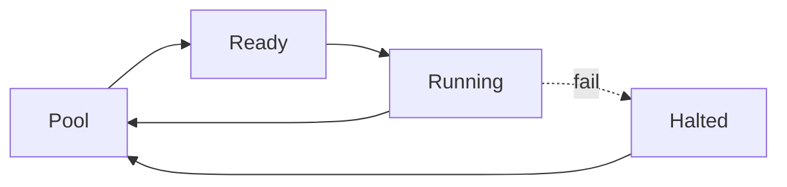

# BUILD-61 — Scale Tier: Nano-Agent

> Source: [https://notion.so/35f3a3fa497c4c549c7f91dbc62a5462](https://notion.so/35f3a3fa497c4c549c7f91dbc62a5462)
> Created: 2026-04-20T18:21:00.000Z | Last edited: 2026-04-20T20:09:00.000Z


---
> **ℹ **Tier 12 · Runtime · Scale: Nano-Agent · Priority: HIGH****

  Nano-Agents are the smallest executable cognitive units. Single-threaded, single-fn, sub-millisecond cycle. Designed to be spawned in swarms of 100s–1000s per host.

## Fold Provenance

*[table: 2 columns]*

## Purpose

Nano-Agents carry out one atomic function with guards, no planner, no reflection loop. They exist to pack a host with cognitive throughput while respecting hard deadlines.

## Dependencies

- **BUILD-69, BUILD-75, BUILD-51** (ancestors)
- **BUILD-68 (Nano Swarm)** — parent
## File Structure

```javascript
crates/nano-agent/
├── src/
│   ├── envelope/
│   │   ├── identity.rs
│   │   └── footprint.rs      # < 1 MB RSS
│   ├── exec/
│   │   ├── call.rs           # single-fn
│   │   └── guard.rs
│   ├── fold/
│   │   ├── halt.rs           # <112 us
│   │   └── pool.rs           # pre-allocated pool
│   └── types.rs
```

## Interfaces & Types

```rust
pub struct NanoAgent {
    pub id: NanoAgentId,
    pub swarm: NanoSwarmId,
    pub fn_name: String,
    pub state: NanoAgentState,
    pub rss_kb: u32,
}

pub enum NanoAgentState { Pooled, Ready, Running, Halted }

pub struct PoolConfig {
    pub size: u32,                 // pre-allocated
    pub per_fn: Vec<(String, u32)>,
    pub halt_budget_us: u32,       // 112 default
}
```

## Implementation SOP

### Step 1: Pool

- Pre-allocate Nano-Agents at boot (size from config)
- Zero-alloc path for invocations
### Step 2: Call

- Single atomic fn call
- Guards inline (pre/post)
- No heap in hot path
### Step 3: Halt

- Guard fail or timeout → halt ≤ 112 μs
- Reclaim to pool
### Step 4: Footprint

- RSS ≤ 1 MB per nano-agent
- No persistent memory
## Acceptance Criteria

- [ ] RSS ≤ 1 MB
- [ ] Zero-alloc hot path
- [ ] Halt ≤ 112 μs
- [ ] Pool reclaim correct
- [ ] Guards inline
- [ ] All tests pass with `vitest run`
- [ ] Throughput ≥ 10k calls/s/core
- [ ] Packing density ≥ 1000 nano-agents/host
## Architecture



## Footprint Budget

*[table: 3 columns]*

## Extended Types

```rust
pub struct HaltReceipt { pub agent: NanoAgentId, pub reason: String, pub duration_us: u32 }
pub struct PoolStats { pub pooled: u32, pub active: u32, pub halted_last_min: u32 }
```

## Reference — Call

```rust
pub fn call(a: &mut NanoAgent, input: &[u8]) -> Result<Bytes, HaltReceipt> {
    guard::pre(a.fn_name, input).map_err(|e| halt(a, e))?;
    let out = atomic::call_fast(a.fn_name, input).map_err(|e| halt(a, e))?;
    guard::post(a.fn_name, &out).map_err(|e| halt(a, e))?;
    Ok(out)
}
```

## Observability

- `nano_agent.calls_total`, label `fn`
- `nano_agent.halt.duration_us` histogram
- `nano_agent.pool.pooled` gauge
- `nano_agent.rss_kb` gauge
## Security

- Atomic fn whitelist enforced at pool init
- Guards capability-checked
- Halt events audited
## Failure Modes

*[table: 3 columns]*

## Operational Runbook

1. **Pool create:** `nano-agent pool --fn embed --size 256`.
1. **Stats:** `nano-agent stats`.
1. **Recycle:** `nano-agent recycle --fn embed`.
## Integration

- Member of Nano Swarms (BUILD-68)
- Bound to Atomic Functions (BUILD-75)
## FAQ

> **Can a nano-agent call another nano-agent?** No — would violate single-fn contract.

> **Does it have memory?** Only stack + slab. No persistent state.

## Changelog

- v0.1.0 — pool, call, guards, halt
- v0.2.0 (planned) — SIMD fast paths
- v0.3.0 (planned) — NUMA-aware pooling

