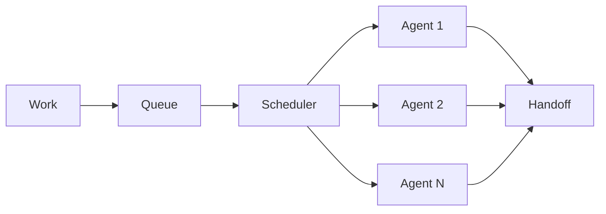

# BUILD-62 — Scale Tier: Team

> Source: [https://notion.so/b49cbc1c0c694e98a679a9f347bb7a79](https://notion.so/b49cbc1c0c694e98a679a9f347bb7a79)
> Created: 2026-04-20T18:21:00.000Z | Last edited: 2026-04-20T20:09:00.000Z


---
> **ℹ **Tier 12 · Organization · Scale: Team · Priority: HIGH****

  A Team is a named pool of Agents sharing a role and a work queue inside a Micro swarm. Teams are the unit of role specialization and the unit of horizontal scaling within a Micro.

## Fold Provenance

*[table: 2 columns]*

## Purpose

Teams group agents by *role* (planner/executor/verifier/scribe/etc.), own a role-scoped work queue, and set per-role policies (memory, timeout, retries). They are the main unit that operators resize.

## Dependencies

- **BUILD-69, BUILD-67, BUILD-59** (ancestors)
## File Structure

```javascript
crates/team/
├── src/
│   ├── roster/
│   │   ├── members.rs
│   │   └── resize.rs
│   ├── queue/
│   │   ├── scheduler.rs
│   │   └── retry.rs
│   ├── fold/
│   │   ├── role_policy.rs
│   │   └── handoff.rs
│   └── types.rs
```

## Interfaces & Types

```rust
pub struct Team {
    pub id: TeamId,
    pub micro: MicroSwarmId,
    pub role: String,
    pub members: Vec<AgentId>,
    pub policy: RolePolicy,
    pub queue_depth: u32,
}

pub struct RolePolicy {
    pub max_members: u32,
    pub min_members: u32,
    pub agent_memory_mb: u32,
    pub default_timeout_ms: u64,
    pub retry: RetryPolicy,
}
```

## Implementation SOP

### Step 1: Roster

- Elastic within min/max bounds
- Resize propagates via Conductor
### Step 2: Queue

- FIFO with priority lanes
- Deadline-aware scheduling
- Retry with exponential backoff
### Step 3: Role policy

- Governs all members uniformly
- Policy changes atomic (new work items only)
### Step 4: Handoff

- Cross-team handoff via Conductor
- Result attributed to originating team
## Acceptance Criteria

- [ ] Roster bounded by min/max
- [ ] Queue ordering correct under load
- [ ] Retry respects backoff
- [ ] Role policy atomic swap
- [ ] Handoff latency ≤ 1 ms within Micro
- [ ] All tests pass with `vitest run`
- [ ] Resize completes ≤ 2 s at 1000 members
- [ ] Starvation-free under load
## Architecture



## Role Template Catalog

*[table: 3 columns]*

## Extended Types

```rust
pub struct RetryPolicy { pub max_attempts: u8, pub backoff_ms: u64, pub multiplier: f32 }
pub struct QueueItem { pub task: WorkUnit, pub priority: Priority, pub enqueued_at: HLCTimestamp }
```

## Reference — Schedule

```rust
pub async fn next(team: &Team) -> Option<QueueItem> {
    let item = queue::pop(team.id).await?;
    if item.deadline < now() { return None; }
    Some(item)
}
```

## Observability

- `team.queue.depth` gauge
- `team.members.count` gauge
- `team.task.latency_ms` histogram
- `team.retry.rate` gauge
## Security

- Role-scoped tools
- Policy changes audited
- Cross-team access capability-gated
## Failure Modes

*[table: 3 columns]*

## Operational Runbook

1. **Resize:** `team resize --id <t> --count 16`.
1. **Policy:** `team policy set --id <t> --timeout 5s`.
1. **Drain:** `team drain --id <t>`.
## Integration

- Member pool of Agents
- Lives in Micro
## FAQ

> **Can a team span Micros?** No — use Conductor virtual aggregates.

> **Can a team have mixed roles?** No — one role per team.

## Changelog

- v0.1.0 — roster, queue, policy, handoff
- v0.2.0 (planned) — skill-based routing
- v0.3.0 (planned) — learned queue priority

