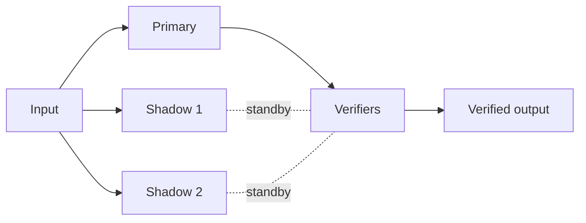

# BUILD-63 — Scale Tier: Nano-Team

> Source: [https://notion.so/95ca8a6b3db64591bb6f11c8ba4fa1fb](https://notion.so/95ca8a6b3db64591bb6f11c8ba4fa1fb)
> Created: 2026-04-20T18:21:00.000Z | Last edited: 2026-04-20T20:09:00.000Z


---
> **ℹ **Tier 12 · Organization · Scale: Nano-Team · Priority: MEDIUM****

  A Nano-Team is a flat coordination of 1–10 Nano-Agents executing one atomic contract with primary/shadow/verifier pattern.

## Fold Provenance

*[table: 2 columns]*

## Purpose

Nano-Teams are the quorum primitive for atomic functions. Three-agent default (primary/shadow/verifier); configurable up to 10 for safety-critical fns.

## Dependencies

- **BUILD-71, BUILD-68, BUILD-75** (ancestors)
## File Structure

```javascript
crates/nano-team/
├── src/
│   ├── quorum/
│   │   ├── primary.rs
│   │   ├── shadow.rs
│   │   └── verifier.rs
│   ├── coord/
│   │   ├── flat.rs           # no leader; HLC ordering
│   │   └── vote.rs
│   ├── fold/
│   │   ├── contract.rs
│   │   └── promote.rs
│   └── types.rs
```

## Interfaces & Types

```rust
pub struct NanoTeam {
    pub id: NanoTeamId,
    pub swarm: NanoSwarmId,
    pub primary: NanoAgentId,
    pub shadows: Vec<NanoAgentId>,
    pub verifiers: Vec<NanoAgentId>,
    pub contract: AtomicContract,
}

pub struct AtomicContract {
    pub fn_name: String,
    pub pre: Vec<String>,
    pub post: Vec<String>,
    pub quorum_size: u8,
}
```

## Implementation SOP

### Step 1: Quorum roles

- 1 primary (runs)
- 1–3 shadows (hot standby)
- 1–3 verifiers (check result)
### Step 2: Flat coordination

- No leader; HLC-ordered messages
- Promotion via majority if primary halts
### Step 3: Vote

- Verifiers compare outputs
- Disagreement → halt + escalate
### Step 4: Promote

- Shadow → primary on halt
- Sub-112 μs handover
## Acceptance Criteria

- [ ] Primary/shadow/verifier roles enforced
- [ ] Flat coordination without deadlock
- [ ] Vote correctness under Byzantine conditions
- [ ] Promotion ≤ 112 μs
- [ ] Escalation path works
- [ ] All tests pass with `vitest run`
- [ ] Quorum size configurable 3–10
- [ ] Fault-tolerant up to f = (n−1)/2
## Architecture



## Quorum Profiles

*[table: 3 columns]*

## Extended Types

```rust
pub struct Vote { pub voter: NanoAgentId, pub hash: [u8;32], pub at: HLCTimestamp }
pub struct PromoteEvent { pub from: NanoAgentId, pub to: NanoAgentId, pub duration_us: u32 }
```

## Reference — Run

```rust
pub async fn run(nt: &NanoTeam, input: &[u8]) -> Result<Vec<u8>> {
    let out = primary::call(nt.primary, input).await?;
    let votes = vote::collect(nt, &out).await?;
    if vote::quorum(&votes, nt.contract.quorum_size) { Ok(out) } else { halt_and_escalate(nt).await }
}
```

## Observability

- `nano_team.runs_total`
- `nano_team.vote.disagreement_total`
- `nano_team.promote.duration_us` histogram
- `nano_team.quorum.size` gauge
## Security

- Votes signed per agent
- Quorum contract immutable mid-run
- Byzantine detection on disagreement
## Failure Modes

*[table: 3 columns]*

## Operational Runbook

1. **Create:** `nano-team new --fn atomic.cmp --profile default`.
1. **Stats:** `nano-team stats <id>`.
1. **Escalate:** `nano-team escalate <id>`.
## Integration

- Member Nano-Agents (BUILD-71)
- Bound to Atomic Functions (BUILD-75)
## FAQ

> **Why not use consensus libraries?** Nano-scale Byzantine is simpler; hot-path latency matters.

> **Can the primary vote?** No — separation of concerns.

## Changelog

- v0.1.0 — quorum, vote, promote
- v0.2.0 (planned) — weighted voting
- v0.3.0 (planned) — hardware-accelerated hashing

