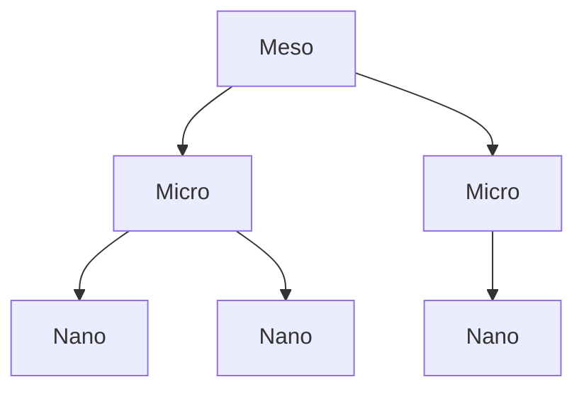

# BUILD-64 — Agent Registry

> Source: [https://notion.so/afd872a181a64d15972fefa6575f1ec8](https://notion.so/afd872a181a64d15972fefa6575f1ec8)
> Created: 2026-04-20T18:21:00.000Z | Last edited: 2026-04-20T20:09:00.000Z


---
> **ℹ **Tier 12 · Topology · Cross-scale · Priority: HIGH****

  Registry of swarm primitives across scales. Exposes a single lookup for *what kind of swarm exists*, its scale, parent/children bindings, and health.

## Fold Provenance

*[table: 2 columns]*

## Purpose

The Swarm Primitive Registry is the *naming service* across scales. Operators, Conductor, and Phoenix Prime all consult it to resolve swarm identity and scale-aware behavior.

## Dependencies

- **BUILD-66, BUILD-67, BUILD-68** (ancestors)
- **BUILD-59 (Conductor)** — consumer
- **BUILD-61 (Phoenix Prime)** — consumer
## File Structure

```javascript
crates/swarm-registry/
├── src/
│   ├── catalog/
│   │   ├── meso.rs
│   │   ├── micro.rs
│   │   └── nano.rs
│   ├── bind/
│   │   ├── parent.rs
│   │   └── children.rs
│   ├── fold/
│   │   ├── scale.rs          # scale-dispatch
│   │   └── health.rs
│   └── types.rs
```

## Interfaces & Types

```rust
pub enum SwarmScale { Meso, Micro, Nano }

pub struct SwarmEntry {
    pub id: SwarmId,
    pub scale: SwarmScale,
    pub parent: Option<SwarmId>,
    pub children: Vec<SwarmId>,
    pub health: Health,
    pub created: HLCTimestamp,
}

pub enum Health { Green, Yellow, Orange, Red, Unknown }
```

## Implementation SOP

### Step 1: Catalog per scale

- Scale-specific metadata (fanout, agent range)
- Scale-specific validators
### Step 2: Parent/child bindings

- Invariant: Meso → Micro → Nano
- No skipping scales
### Step 3: Scale dispatch

- Given a SwarmId, return scale-appropriate handler
- Used by Conductor and Phoenix Prime
### Step 4: Health

- Roll up child health to parent
- Red if any child Red; Orange if ≥ 10% Orange; etc.
## Acceptance Criteria

- [ ] Scale invariants enforced
- [ ] Parent/child bindings consistent
- [ ] Scale dispatch O(1)
- [ ] Health rollup accurate
- [ ] Registry queries ≤ 100 μs
- [ ] All tests pass with `vitest run`
- [ ] Concurrent updates safe
- [ ] Global view ≤ 5 s old
## Architecture



## Health Rollup Rules

*[table: 2 columns]*

## Extended Types

```rust
pub struct HealthRollup { pub scale: SwarmScale, pub red: u32, pub orange: u32, pub yellow: u32, pub green: u32 }
pub struct Invariant { pub name: String, pub rule: String }
```

## Reference — Resolve

```rust
pub async fn resolve(id: SwarmId) -> Option<SwarmEntry> {
    let scale = scale::of(id)?;
    catalog::get(scale, id).await
}
```

## Observability

- `registry.swarms.by_scale` gauge (3 labels)
- `registry.health.by_scale` gauge
- `registry.lookup.latency_us` histogram
- `registry.invariant.violations_total`
## Security

- Registry mutations capability-gated
- Scale invariants signed
- Cross-scale traffic audited
## Failure Modes

*[table: 3 columns]*

## Operational Runbook

1. **Inspect:** `swarm-reg ls --scale micro`.
1. **Health:** `swarm-reg health --tree`.
1. **Validate:** `swarm-reg validate`.
## Integration

- Used by Conductor, Phoenix Prime, Immune
## FAQ

> **Can a Nano have children?** No — Nano is a leaf.

> **How is health computed?** Bottom-up rollup on every child state change.

## Changelog

- v0.1.0 — catalog, binding, dispatch, rollup
- v0.2.0 (planned) — geo-aware sharding
- v0.3.0 (planned) — signed lineage proofs

