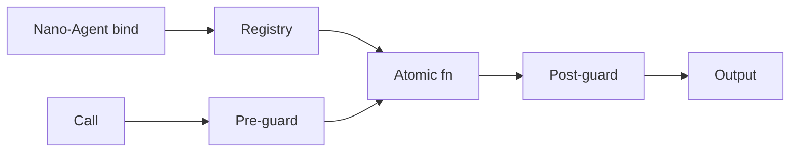

# BUILD-65 — Atomic Function Layer

> Source: [https://notion.so/9b6f811f1b7f40ccb8d9f630f7ea173e](https://notion.so/9b6f811f1b7f40ccb8d9f630f7ea173e)
> Created: 2026-04-20T18:21:00.000Z | Last edited: 2026-04-20T20:09:00.000Z


---
> **ℹ **Tier 12 · Primitives · Cross-cutting · Priority: CRITICAL****

  Canonical library of atomic cognitive functions — the leaves at the bottom of the scale hierarchy. Every Nano-Agent binds to exactly one. All higher-level cognition reduces to compositions of these.

## Fold Provenance

*[table: 2 columns]*

## Purpose

Atomic Functions (AFs) are the indivisible operations Nano-Agents execute. They are pure-in-intent (side effects flagged), type-checked, guarded, and individually versioned. The library is the *alphabet* of NeuroLoom cognition.

## Dependencies

- **BUILD-27 (Fortress)** — policy
- **BUILD-59 (Conductor)** — binding
- **BUILD-68, BUILD-71, BUILD-73** — consumers
## File Structure

```javascript
crates/atomic-fn/
├── src/
│   ├── kernel/
│   │   ├── embed.rs
│   │   ├── cmp.rs
│   │   ├── hash.rs
│   │   ├── encrypt.rs
│   │   ├── vote.rs
│   │   ├── norm.rs
│   │   ├── tokenize.rs
│   │   ├── dedup.rs
│   │   ├── classify.rs
│   │   └── reduce.rs
│   ├── guards/
│   │   ├── pre.rs
│   │   └── post.rs
│   ├── fold/
│   │   ├── registry.rs
│   │   └── bind.rs
│   └── types.rs
```

## Interfaces & Types

```rust
pub struct AtomicFn {
    pub name: String,           // dotted: atomic.embed
    pub version: Semver,
    pub input_type: TypeId,
    pub output_type: TypeId,
    pub pure: bool,
    pub guards: GuardSet,
    pub cost: Cost,
}

pub struct Cost { pub cpu_ns: u32, pub energy_uj: u32, pub memory_b: u32 }

pub trait AtomicInvoke: Send + Sync {
    fn call(&self, input: &[u8]) -> Result<Vec<u8>>;
}
```

## Implementation SOP

### Step 1: Kernel set

- Baseline 10 functions: embed, cmp, hash, encrypt, vote, norm, tokenize, dedup, classify, reduce
- Each has reference impl + SIMD fast path
### Step 2: Guards

- Pre: input type + size + invariants
- Post: output type + invariants + bounds
### Step 3: Binding

- Nano-Agents bind at boot
- Type compatibility checked
### Step 4: Versioning

- Semver; new version = new registry entry
- Old version retained until all Nanos upgraded
## Acceptance Criteria

- [ ] 10 kernel fns implemented
- [ ] Type + guard checks enforced
- [ ] Versioning works side-by-side
- [ ] Cost annotations accurate
- [ ] Pure fns deterministic
- [ ] All tests pass with `vitest run`
- [ ] Per-fn P99 within cost budget
- [ ] Registry lookup ≤ 10 μs
## Architecture



## Kernel Catalog (excerpt)

*[table: 5 columns]*

## Extended Types

```rust
pub struct Semver { pub major: u32, pub minor: u32, pub patch: u32 }
pub struct BindReceipt { pub nano: NanoAgentId, pub fn_name: String, pub version: Semver }
```

## Reference — Call

```rust
pub fn call(name: &str, input: &[u8]) -> Result<Vec<u8>> {
    let f = registry::lookup(name).ok_or(Error::NoFn)?;
    pre_guard::run(&f, input)?;
    let out = f.call(input)?;
    post_guard::run(&f, &out)?;
    Ok(out)
}
```

## Observability

- `atomic.calls_total`, label `fn`
- `atomic.guard.fail_total`, label `phase`
- `atomic.cost_ns` histogram, label `fn`
- `atomic.version.deprecated_calls_total`
## Security

- Side-effecting fns flagged and audited
- Keys segregated (atomic.encrypt cannot see other keys)
- Guard bypass impossible from caller
- Version downgrade requires capability
## Failure Modes

*[table: 3 columns]*

## Operational Runbook

1. **List:** `atomic ls`.
1. **Bind:** `atomic bind --nano <id> --fn atomic.embed`.
1. **Deprecate:** `atomic deprecate --fn atomic.embed --version 0.1.0`.
## Integration

- Bound by Nano-Agents (BUILD-71)
- Composed into Nano Swarms (BUILD-68)
- Referenced by Conductor addressing
## FAQ

> **Can I add my own atomic?** Yes — submit with cost proofs + tests; undergoes HMV + security review.

> **Why not allow composition at this level?** Composition happens in Nano/Micro — keeps atomic leaves simple.

> **How pure is 'pure'?** Deterministic given input; no globals; no I/O. Side-effecting fns flagged.

## Changelog

- v0.1.0 — 10 kernel fns, guards, registry, binding
- v0.2.0 (planned) — 20 more fns (graph ops, proof primitives)
- v0.3.0 (planned) — hardware-accelerated SIMD lanes

