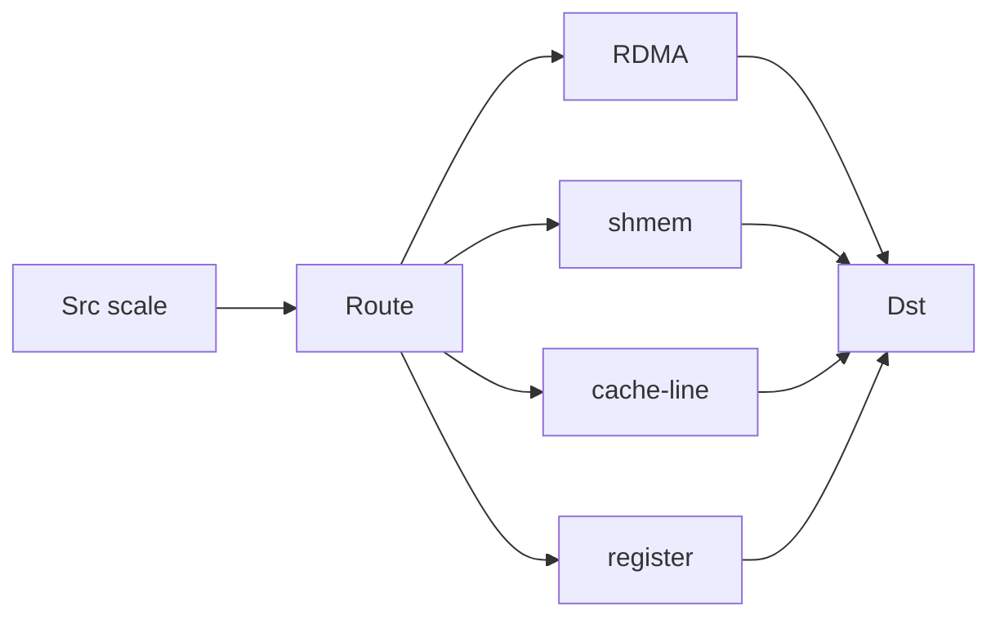

# BUILD-66 — Cross-Scale Fabric

> Source: [https://notion.so/f13c09074164402eaaca92437a1e4f33](https://notion.so/f13c09074164402eaaca92437a1e4f33)
> Created: 2026-04-20T18:29:00.000Z | Last edited: 2026-04-20T20:09:00.000Z


---
> **ℹ **Tier 13 · Fabric · Cross-scale · Priority: HIGH****

  Message fabric that spans scales. Routes messages meso↔micro↔nano↔pico with scale-appropriate delivery guarantees and cost profiles.

## Fold Provenance

*[table: 2 columns]*

## Purpose

Different scales have wildly different cost/latency envelopes. Scale-Bridge auto-selects the right transport: RDMA for meso, shared memory for micro, cache-line atomics for nano, register for pico.

## Dependencies

- **BUILD-63, BUILD-59, BUILD-74** (ancestors)
## File Structure

```javascript
crates/scale-bridge/
├── src/
│   ├── route/
│   │   ├── scale_pair.rs
│   │   └── policy.rs
│   ├── transports/
│   │   ├── rdma.rs
│   │   ├── shmem.rs
│   │   ├── cache.rs
│   │   └── reg.rs
│   ├── fold/
│   │   ├── promote.rs       # nano -> micro
│   │   └── demote.rs        # micro -> nano
│   └── types.rs
```

## Interfaces & Types

```rust
pub struct BridgeMsg {
    pub src: AnyId,
    pub dst: AnyId,
    pub payload: Bytes,
    pub qos: Qos,
}

pub enum Qos { BestEffort, Reliable, Ordered, RealTime }
```

## Implementation SOP

### Step 1: Scale pair routing

- (src_scale, dst_scale) → transport
- Meso↔Meso = RDMA, Micro↔Micro = shmem, etc.
### Step 2: Transport policy

- QoS-aware selection
- Back-pressure propagation
### Step 3: Promotion/demotion

- Crossing scales requires reformat
- Cost accounted per hop
## Acceptance Criteria

- [ ] All scale pairs supported
- [ ] QoS honored
- [ ] Cross-scale cost measured
- [ ] Back-pressure works end-to-end
- [ ] All tests pass with `vitest run`
- [ ] Meso↔Meso P99 ≤ 100 µs
- [ ] Micro↔Micro P99 ≤ 5 µs
- [ ] Nano↔Nano P99 ≤ 500 ns
## Architecture



## Transport Matrix

*[table: 5 columns]*

## Extended Types

```rust
pub struct HopCost { pub bytes: u64, pub ns: u32, pub energy_nj: u32 }
```

## Reference — Send

```rust
pub async fn send(m: BridgeMsg) -> Result<()> {
    let t = route::select(&m).await?;
    transports::dispatch(t, m).await
}
```

## Observability

- `bridge.sends_total` by scale-pair
- `bridge.latency_ns` histogram by scale-pair
- `bridge.backpressure_events_total`
## Security

- Capability check per scale boundary
- Cross-scale payload size caps
- Audited promotions
## Failure Modes

*[table: 3 columns]*

## Operational Runbook

1. **Trace:** `bridge trace --pair meso-micro`.
1. **Bench:** `bridge bench --pair micro-nano`.
1. **Quota:** `bridge quota --pair meso-meso 1GB/s`.
## Integration

- Used by Conductor (BUILD-59), Queen (BUILD-08)
- Consults Swarm Registry (BUILD-74)
## FAQ

> **Why no direct Meso↔Pico?** The gap is too wide; always route via Nano.

## Changelog

- v0.1.0 — 4 transports, routing, QoS
- v0.2.0 (planned) — adaptive QoS
- v0.3.0 (planned) — ML-driven selection

