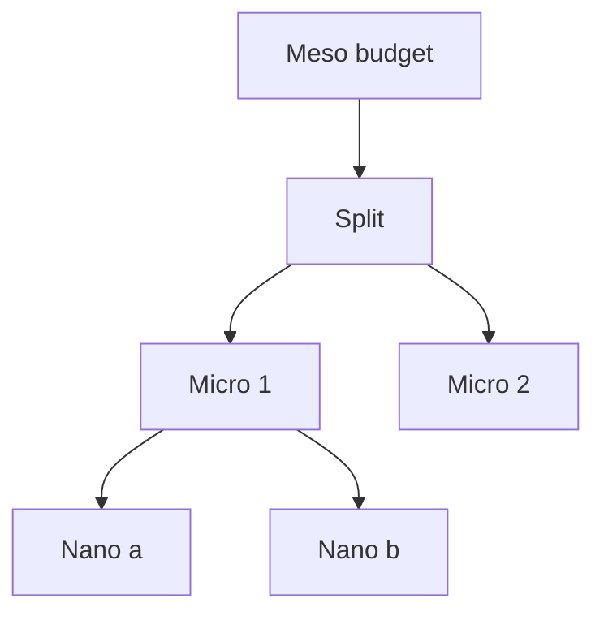

# BUILD-67 — Lineage Engine

> Source: [https://notion.so/315be29a6af946c786b1defdba9e79ae](https://notion.so/315be29a6af946c786b1defdba9e79ae)
> Created: 2026-04-20T18:29:00.000Z | Last edited: 2026-04-20T20:09:00.000Z


---
> **ℹ **Tier 13 · Governance · Cross-scale · Priority: HIGH****

  Composes energy/compute/memory budgets across scales. A Meso budget decomposes into Micro → Nano → Pico allocations with guarantees and shedding rules.

## Fold Provenance

*[table: 2 columns]*

## Purpose

A single Meso budget (say 10 kW-hours / day) must be split fairly and bounded at every scale so no Micro/Nano can starve others. Hierarchical Budget Composition makes the split explicit, inspectable, and enforceable.

## Dependencies

- **BUILD-47, BUILD-74, BUILD-08** (ancestors)
## File Structure

```javascript
crates/budget-hier/
├── src/
│   ├── split/
│   │   ├── proportional.rs
│   │   ├── priority.rs
│   │   └── elastic.rs
│   ├── enforce/
│   │   ├── ceiling.rs
│   │   └── shed.rs
│   ├── fold/
│   │   ├── rollup.rs
│   │   └── rebalance.rs
│   └── types.rs
```

## Interfaces & Types

```rust
pub struct BudgetNode {
    pub scale: SwarmScale,
    pub self_id: SwarmId,
    pub ceiling: Budget,
    pub reserved: Budget,
    pub used: Budget,
    pub children: Vec<SwarmId>,
}

pub enum SplitPolicy { Equal, Weighted(Vec<f32>), Priority, Elastic }
```

## Implementation SOP

### Step 1: Split

- Meso ceiling → Micro ceilings via policy
- Micro → Nano similarly; Nano → Pico via SIMD lanes
### Step 2: Enforce

- Per-tick check: reserved + pending ≤ ceiling
- Shed lowest priority on breach
### Step 3: Rollup / rebalance

- Unused budget rolls back up every minute
- Queen redistributes per policy
## Acceptance Criteria

- [ ] Split honored at every level
- [ ] Ceilings enforced atomically
- [ ] Shedding deterministic
- [ ] Rollup refund accurate
- [ ] Rebalance converges
- [ ] All tests pass with `vitest run`
- [ ] Decision latency ≤ 1 ms
- [ ] Audit trail for every reservation
## Architecture



## Policy Matrix

*[table: 3 columns]*

## Extended Types

```rust
pub struct ShedDecision { pub target: SwarmId, pub reason: String, pub amount: Budget }
```

## Reference — Reserve

```rust
pub async fn reserve(node: &BudgetNode, need: Budget) -> Result<()> {
    if node.reserved.add(&need).gt(&node.ceiling) { return Err(Error::OverBudget); }
    crc::reserve(need).await
}
```

## Observability

- `budget.used_pct` gauge per scale
- `budget.shed_total` counter
- `budget.rebalance.latency_ms` histogram
## Security

- Capability-gated policy change
- Signed rollup receipts
- Audit-only if manual override
## Failure Modes

*[table: 3 columns]*

## Operational Runbook

1. **Inspect:** `budget show --tree`.
1. **Policy:** `budget policy --scope micro --type priority`.
1. **Rebalance:** `budget rebalance now`.
## Integration

- Consumed by every scale's scheduler
## FAQ

> **What if all budgets are exhausted?** Meso enters graceful degrade mode via Fortress.

## Changelog

- v0.1.0 — split, enforce, rollup
- v0.2.0 (planned) — market-based allocation
- v0.3.0 (planned) — predictive ceilings

