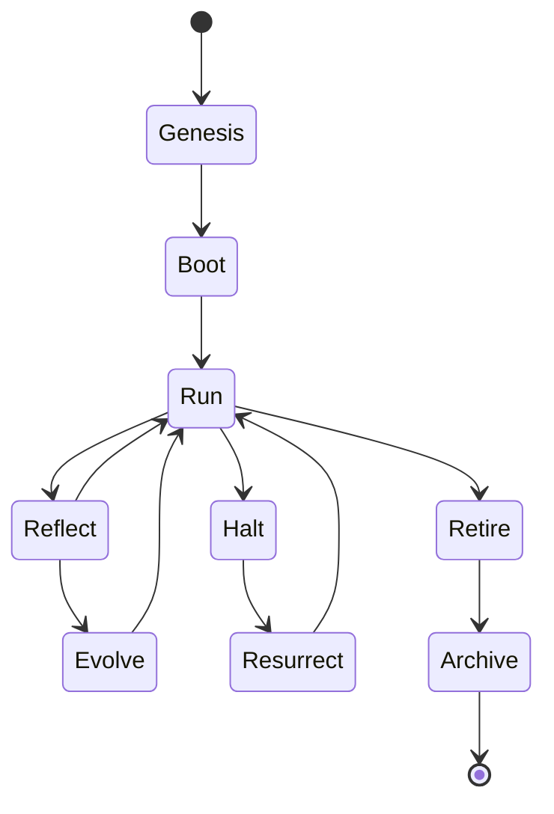

# BUILD-70 — Topology Optimizer

> Source: [https://notion.so/d24f44389ee84e1981410d56c6f75ad1](https://notion.so/d24f44389ee84e1981410d56c6f75ad1)
> Created: 2026-04-20T18:31:00.000Z | Last edited: 2026-04-20T20:10:00.000Z


---
> **ℹ **Tier 13 · Lifecycle · Per-agent · Priority: HIGH****

  Canonical unified state machine spanning every cognitive entity: Genesis → Boot → Live (run ↔ reflect ↔ evolve) → Halt → Resurrect → Retire → Archive.

## Fold Provenance

*[table: 2 columns]*

## Purpose

Provide a single, inspectable state machine that every Agent / Sub-Agent / Nano-Agent / Pico-Agent conforms to. Enables uniform ops tools, uniform Phoenix coverage, uniform audit.

## Dependencies

- **BUILD-61, BUILD-17, BUILD-07** (ancestors)
## File Structure

```javascript
crates/lifecycle/
├── src/
│   ├── states/
│   │   ├── genesis.rs
│   │   ├── boot.rs
│   │   ├── live.rs
│   │   ├── halt.rs
│   │   ├── resurrect.rs
│   │   ├── retire.rs
│   │   └── archive.rs
│   ├── transitions.rs
│   ├── fold/
│   │   └── ledger.rs
│   └── types.rs
```

## Interfaces & Types

```rust
pub enum LifeState { Genesis, Boot, Live(Live), Halt(HaltReason), Resurrect, Retire, Archive }
pub enum Live { Run, Reflect, Evolve }
```

## Implementation SOP

### Step 1: States

- Each state has entry + exit hook
- Ledger event per transition
### Step 2: Transitions

- Typed; no illegal transitions
- `try_transition` returns proof or error
### Step 3: Ledger

- Immortality records every transition
- Rebuild state from ledger alone
## Acceptance Criteria

- [ ] No illegal transitions
- [ ] Ledger completeness
- [ ] State rebuildable from ledger
- [ ] Hooks idempotent
- [ ] All tests pass with `vitest run`
- [ ] Transition ≤ 1 ms
- [ ] Works at every scale
- [ ] Audit-ready
## Architecture



## Hook Table

*[table: 3 columns]*

## Extended Types

```rust
pub struct Transition { pub from: LifeState, pub to: LifeState, pub at: HLCTimestamp, pub cause: String }
```

## Reference — Transition

```rust
pub fn transition(cur: &mut LifeState, to: LifeState) -> Result<Transition> {
    if !transitions::legal(cur, &to) { return Err(Error::Illegal); }
    let t = Transition::new(cur.clone(), to.clone());
    *cur = to;
    ledger::append(&t);
    Ok(t)
}
```

## Observability

- `lifecycle.transitions_total` by state
- `lifecycle.age_s` histogram
- `lifecycle.resurrections_total`
## Security

- Only privileged callers may force Retire
- Genome integrity checked at Boot
- Ledger append-only
## Failure Modes

*[table: 3 columns]*

## Operational Runbook

1. **Trace:** `life trace --agent <id>`.
1. **Retire:** `life retire --agent <id>`.
1. **Rebuild:** `life rebuild --agent <id>`.
## Integration

- Universal across BUILD-69/70/71/76
- Phoenix Prime reads halt state
## FAQ

> **Does a Nano-Agent have all states?** Yes — but Live.Evolve may be a no-op for stateless Nanos.

## Changelog

- v0.1.0 — states, transitions, ledger
- v0.2.0 (planned) — multi-agent transactions
- v0.3.0 (planned) — time-travel replay

