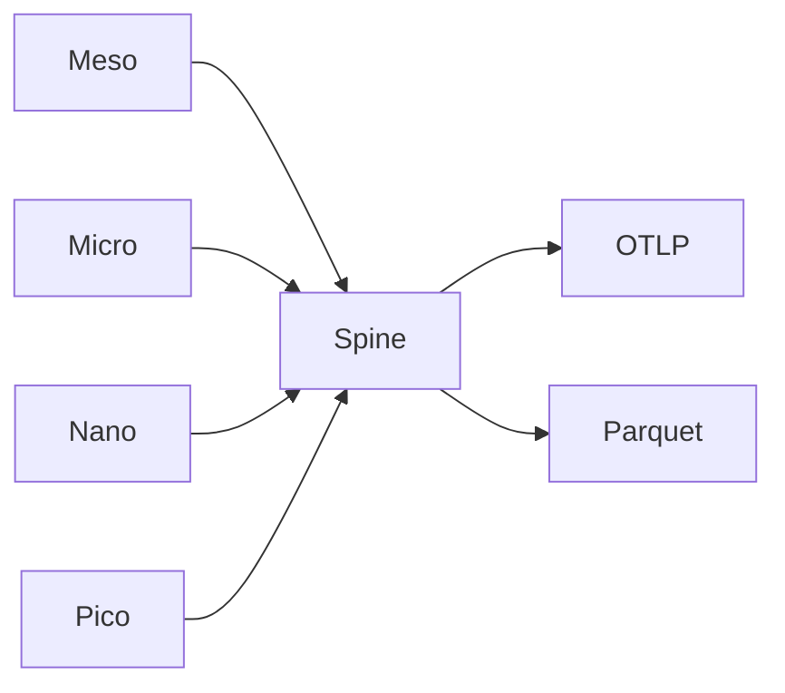

# BUILD-71 — Observability Stack

> Source: [https://notion.so/358a071221b8406dbf42db88a9ad697a](https://notion.so/358a071221b8406dbf42db88a9ad697a)
> Created: 2026-04-20T18:33:00.000Z | Last edited: 2026-04-20T20:10:00.000Z


---
> **ℹ **Tier 14 · Observability · Cross-scale · Priority: HIGH****

  Unified traces / metrics / logs / events across Meso→Femto. One correlation id spans a planner's intent all the way to a SIMD lane mask.

## Fold Provenance

*[table: 2 columns]*

## Purpose

Without cross-scale correlation, debugging a slow Meso request that bottlenecks in a Nano call is guesswork. The Spine guarantees continuous trace IDs and sampled metrics at every scale.

## Dependencies

- **BUILD-74, BUILD-82** (ancestors)
## File Structure

```javascript
crates/obs-spine/
├── src/
│   ├── id/
│   │   ├── trace.rs
│   │   └── span.rs
│   ├── sinks/
│   │   ├── otlp.rs
│   │   └── parquet.rs
│   ├── fold/
│   │   ├── propagate.rs
│   │   └── sample.rs
│   └── types.rs
```

## Interfaces & Types

```rust
pub struct SpineCtx { pub trace: TraceId, pub span: SpanId, pub scale: SwarmScale }
```

## Implementation SOP

1. Propagate SpineCtx across every scale boundary.
1. Sample scale-appropriate rate (Pico ~0.001%, Meso 100%).
1. Emit to OTLP + Parquet archive.
## Acceptance Criteria

- [ ] Trace id unbroken end-to-end
- [ ] Sample rates per scale honored
- [ ] OTLP + archive both land
- [ ] Overhead ≤ 2%
- [ ] All tests pass with `vitest run`
- [ ] Lossy scales documented
- [ ] Exemplars linked to traces
- [ ] Scale-tagged dashboards
## Architecture



## Sample Rate Table

*[table: 2 columns]*

## Extended Types

```rust
pub struct ScaleTag { pub scale: SwarmScale, pub id: String }
```

## Reference — Emit

```rust
pub fn emit(ctx: &SpineCtx, ev: &Event) { if sample::should(ctx) { sinks::push(ctx, ev); } }
```

## Observability

- `spine.events_total` by scale
- `spine.dropped_total` by reason
- `spine.overhead_pct` gauge
## Security

- PII redaction per scale
- TraceId tamper check
## Failure Modes

*[table: 3 columns]*

## Operational Runbook

1. **Tail:** `spine tail --trace <t>`.
1. **Sample:** `spine sample --scale nano 1%`.
## Integration

- Feeds dashboards, Oracle (BUILD-60), Topo-Opt (BUILD-85)
## FAQ

> **Why sample Pico at all?** For epsilon-level anomaly detection; otherwise drop.

## Changelog

- v0.1.0 — propagation, sampling, dual-sink
- v0.2.0 (planned) — eBPF auto-instrument
- v0.3.0 (planned) — causal graph reconstruction

