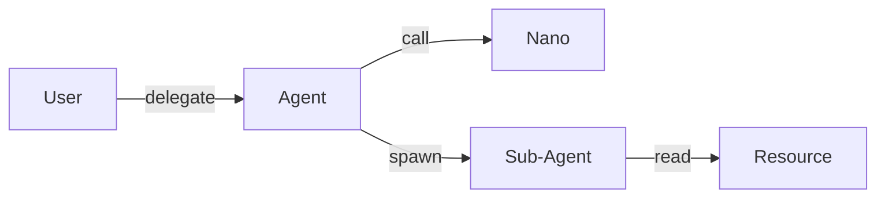

# BUILD-72 — Identity & AuthN

> Source: [https://notion.so/63724d5f10e140209cc8945b5b6eba45](https://notion.so/63724d5f10e140209cc8945b5b6eba45)
> Created: 2026-04-20T18:33:00.000Z | Last edited: 2026-04-20T20:10:00.000Z


---
> **ℹ **Tier 14 · Identity · Cross-scale · Priority: HIGH****

  Typed graph of principals (Users, Agents at every scale, Tenants, Peers) and capabilities (read, write, delegate, spawn). Every dispatch checks the graph.

## Fold Provenance

*[table: 2 columns]*

## Purpose

Collapse ad-hoc permissions into a single typed graph. Enables formal reasoning: "Can Nano-Agent X call Federation peer Y?" is a graph query.

## Dependencies

- **BUILD-23, BUILD-27, BUILD-74** (ancestors)
## File Structure

```javascript
crates/id-graph/
├── src/
│   ├── nodes/
│   │   ├── principal.rs
│   │   └── resource.rs
│   ├── edges/
│   │   ├── capability.rs
│   │   └── delegation.rs
│   ├── fold/
│   │   ├── reason.rs
│   │   └── revoke.rs
│   └── types.rs
```

## Interfaces & Types

```rust
pub struct Capability { pub verb: Verb, pub resource: ResId, pub scope: Scope, pub ttl: Duration }
pub enum Verb { Read, Write, Call, Spawn, Delegate, Halt }
```

## Implementation SOP

1. Principal nodes per scale (incl. Pico by group).
1. Edges = capability grants; signed.
1. `can(principal, verb, resource)` is the single auth call.
1. Revocation propagates as tombstones.
## Acceptance Criteria

- [ ] `can()` O(log n)
- [ ] Revocation ≤ 100 ms global
- [ ] Delegation chains auditable
- [ ] No capability escape
- [ ] All tests pass with `vitest run`
- [ ] Graph snapshotted hourly
- [ ] Cycles disallowed
- [ ] Blast radius bounded on compromise
## Architecture



## Verb × Scope Matrix

*[table: 5 columns]*

## Extended Types

```rust
pub struct DelegationProof { pub from: PrincipalId, pub to: PrincipalId, pub cap: Capability, pub sig: Sig }
```

## Reference — Check

```rust
pub fn can(p: &Principal, v: Verb, r: &ResId) -> bool { graph::reach(p, v, r) }
```

## Observability

- `id.checks_total` by verdict
- `id.revocations_total`
- `id.delegation_depth` histogram
## Security

- Signed grants; append-only ledger
- Tombstones pervade within SLA
## Failure Modes

*[table: 3 columns]*

## Operational Runbook

1. **Grant:** `id grant --from A --to B --verb call`.
1. **Revoke:** `id revoke <cap>`.
1. **Audit:** `id path --from A --to R`.
## Integration

- Consulted by Conductor (BUILD-59), Bridge (BUILD-78), Federation (BUILD-83)
## FAQ

> **Does every Pico need a principal?** No — grouped by parent Nano.

## Changelog

- v0.1.0 — nodes, edges, can(), revoke
- v0.2.0 (planned) — attribute-based policies
- v0.3.0 (planned) — formal verification

