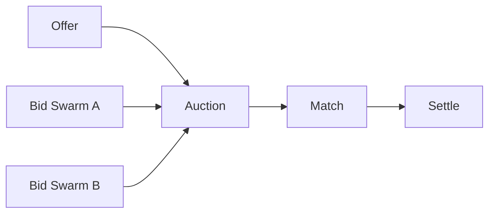

# BUILD-73 — Agent Economics

> Source: [https://notion.so/866d2626d51c4340a11ed79fc5590c7b](https://notion.so/866d2626d51c4340a11ed79fc5590c7b)
> Created: 2026-04-20T18:33:00.000Z | Last edited: 2026-04-20T20:10:00.000Z


---
> **ℹ **Tier 14 · Economics · Cross-scale · Priority: MEDIUM****

  Market where swarms bid on cognitive work. Price = f(urgency, class, expected fitness). Prevents silent starvation and exposes cost of cognition.

## Fold Provenance

*[table: 2 columns]*

## Purpose

Schedulers today are greedy/heuristic. A market introduces explicit pricing so operators can reason about cost, and swarms can specialize (cheap, fast, high-quality).

## Dependencies

- **BUILD-47, BUILD-60, BUILD-84** (ancestors)
- **BUILD-80 (Scheduler)** — integration point
## File Structure

```javascript
crates/epi-market/
├── src/
│   ├── offer/
│   │   ├── post.rs
│   │   └── bid.rs
│   ├── match_/
│   │   ├── vickrey.rs
│   │   └── fallback.rs
│   ├── fold/
│   │   ├── settle.rs
│   │   └── reputation.rs
│   └── types.rs
```

## Interfaces & Types

```rust
pub struct Offer { pub program: ProgramId, pub max_price: CRC, pub deadline: HLCTimestamp }
pub struct Bid { pub swarm: SwarmId, pub price: CRC, pub eta: Duration, pub fitness_est: f32 }
```

## Implementation SOP

1. Post offer (planner).
1. Eligible swarms bid via ISA cost model.
1. Second-price (Vickrey) match within deadline.
1. Settle via CRC; update reputation.
## Acceptance Criteria

- [ ] Vickrey correct
- [ ] No starvation (fallback)
- [ ] Settlement atomic
- [ ] Reputation compounds
- [ ] All tests pass with `vitest run`
- [ ] Match ≤ deadline × 0.1
- [ ] Collusion detection
- [ ] Budget ceiling respected
## Architecture



## Mechanism Table

*[table: 3 columns]*

## Extended Types

```rust
pub struct Reputation { pub swarm: SwarmId, pub score: f32, pub volume: u64 }
```

## Reference — Match

```rust
pub fn match_bids(o: &Offer, bids: &[Bid]) -> Option<&Bid> { vickrey::second_price(o, bids) }
```

## Observability

- `market.offers_total`, `market.matched_total`
- `market.clearing_price` histogram
- `market.reputation.latest` gauge
## Security

- Bids signed; no double-spend via CRC
- Collusion detection (coordinated bid patterns)
## Failure Modes

*[table: 3 columns]*

## Operational Runbook

1. **Post:** `market post --program <p> --max 100`.
1. **Inspect:** `market book`.
## Integration

- Integrates with Scheduler (BUILD-80)
- Reputation feeds Oracle (BUILD-60)
## FAQ

> **Who pays?** The originating principal via CRC.

## Changelog

- v0.1.0 — Vickrey, reputation, settle
- v0.2.0 (planned) — futures/forwards
- v0.3.0 (planned) — cross-Meso markets

