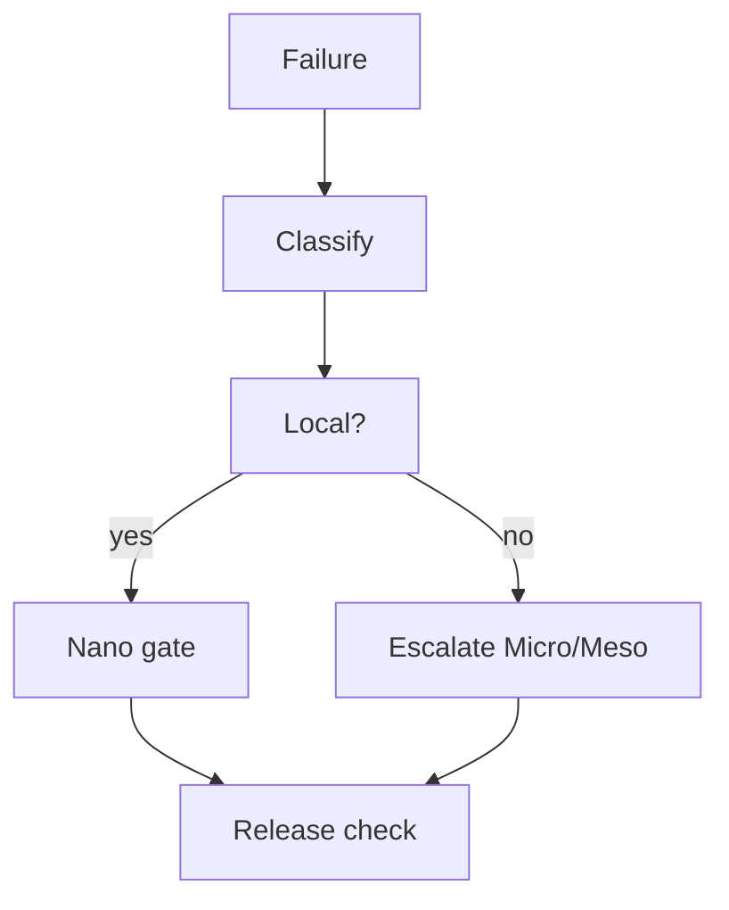

# BUILD-74 — Safety Engine

> Source: [https://notion.so/147bd145025a435db8cfc1ad5c9be039](https://notion.so/147bd145025a435db8cfc1ad5c9be039)
> Created: 2026-04-20T18:33:00.000Z | Last edited: 2026-04-20T20:10:00.000Z


---
> **ℹ **Tier 14 · Safety · Cross-scale · Priority: HIGH****

  Bounds blast radius when a swarm/agent misbehaves. Failure classes propagate with explicit isolation rules.

## Fold Provenance

*[table: 2 columns]*

## Purpose

Without explicit quarantine, one corrupted Nano genome can cascade. This spec defines failure classes, propagation rules, and quarantine gates at each scale boundary.

## Dependencies

- **BUILD-12, BUILD-27, BUILD-82** (ancestors)
## File Structure

```javascript
crates/quarantine/
├── src/
│   ├── classify/
│   │   └── kind.rs
│   ├── propagate/
│   │   ├── uptree.rs
│   │   └── peer.rs
│   ├── fold/
│   │   ├── gate.rs
│   │   └── release.rs
│   └── types.rs
```

## Interfaces & Types

```rust
pub enum FailKind { Soft, Bug, Violation, Corruption, Byzantine }
pub struct Quarantine { pub target: SwarmId, pub kind: FailKind, pub scope: Scope, pub ttl: Duration }
```

## Implementation SOP

1. Classify failure at point of detection.
1. Propagate: Soft stays local; Corruption/Byzantine escalates up.
1. Gate at scale boundary (Nano→Micro, Micro→Meso).
1. Release after TTL + healthy probe.
## Acceptance Criteria

- [ ] Classification correct ≥ 95%
- [ ] Escalation latency ≤ 1 s
- [ ] Gate atomic
- [ ] Release safe
- [ ] All tests pass with `vitest run`
- [ ] No silent spread
- [ ] Audit every quarantine
- [ ] Co-quarantine related entities
## Architecture



## Class → Scope Matrix

*[table: 3 columns]*

## Extended Types

```rust
pub struct HealthProbe { pub target: SwarmId, pub passes: u32, pub last_ok: HLCTimestamp }
```

## Reference — Enter

```rust
pub fn enter(q: Quarantine) { gate::apply(&q); immortality::append(&q); }
```

## Observability

- `quarantine.active` gauge by kind
- `quarantine.entries_total`, `releases_total`
- `quarantine.ttl_remaining_s` gauge
## Security

- Only gate service may apply
- Immutable ledger entry
## Failure Modes

*[table: 3 columns]*

## Operational Runbook

1. **Inspect:** `quar ls`.
1. **Release:** `quar release <id>`.
1. **Force:** `quar force <id> --kind byzantine`.
## Integration

- Lifecycle Halt reasons map to FailKind
- Phoenix consults before resurrect
## FAQ

> **Can Picos be quarantined?** Yes, by group (their parent Nano disables that SIMD lane).

## Changelog

- v0.1.0 — classify, propagate, gate, release
- v0.2.0 (planned) — learned classifier
- v0.3.0 (planned) — auto-postmortem

