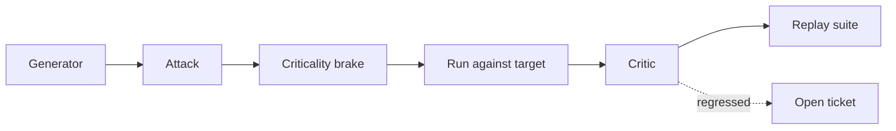

# BUILD-76 — Red-Team Fabric

> Source: [https://notion.so/4b4bb642186d4fe8a98831c72086ba91](https://notion.so/4b4bb642186d4fe8a98831c72086ba91)
> Created: 2026-04-20T18:35:00.000Z | Last edited: 2026-04-20T20:10:00.000Z


---
> **ℹ **Tier 14 · Red-team · Cross-scale · Priority: HIGH****

  Continuously attacks the swarm fabric to surface brittleness. Pairs generator with critic; all attacks run under Criticality Brake.

## Fold Provenance

*[table: 2 columns]*

## Purpose

Make robustness a continuous process, not a periodic audit. Generates adversarial inputs, adversarial genomes, adversarial topologies.

## Dependencies

- **BUILD-25, BUILD-26, BUILD-48** (ancestors)
## File Structure

```javascript
crates/adv-harness/
├── src/
│   ├── gen/
│   │   ├── input.rs
│   │   ├── genome.rs
│   │   └── topology.rs
│   ├── eval/
│   │   └── critic.rs
│   ├── fold/
│   │   ├── brake.rs
│   │   └── replay.rs
│   └── types.rs
```

## Interfaces & Types

```rust
pub struct Attack { pub vector: AttackKind, pub payload: Vec<u8>, pub target: SwarmId }
pub enum AttackKind { InputPerturb, GenomeCrossover, TopologyCrash, ByzantinePeer }
```

## Implementation SOP

1. Generator proposes attacks.
1. Critic scores expected damage.
1. Criticality Brake bounds blast radius.
1. Replay captured attacks into regression suite.
## Acceptance Criteria

- [ ] All attack kinds supported
- [ ] Brake bounds damage
- [ ] Findings land in regression
- [ ] Quarantine on real breach
- [ ] All tests pass with `vitest run`
- [ ] Metrics: coverage/novelty
- [ ] Seeded + stochastic modes
- [ ] Ledger-audited
## Architecture



## Attack Catalog

*[table: 3 columns]*

## Extended Types

```rust
pub struct AttackReport { pub attack: Attack, pub impact: f32, pub reproducible: bool }
```

## Reference — Run

```rust
pub async fn run(a: Attack) -> AttackReport { brake::bounded_run(a).await }
```

## Observability

- `adv.attacks_total` by kind
- `adv.blast_radius` histogram
- `adv.new_findings_total`
## Security

- Never run in prod without brake
- All attacks signed & audited
## Failure Modes

*[table: 3 columns]*

## Operational Runbook

1. **Run:** `adv run --kind input --target <m>`.
1. **Replay:** `adv replay tests/adv_suite`.
## Integration

- Feeds Quarantine (BUILD-89)
- Uses Oracle (BUILD-60) for critic
## FAQ

> **Does this run in prod?** Only low-risk inputs; invasive attacks are staging-only.

## Changelog

- v0.1.0 — gen, critic, brake, replay
- v0.2.0 (planned) — LLM red-team loop
- v0.3.0 (planned) — coverage-guided fuzzing

