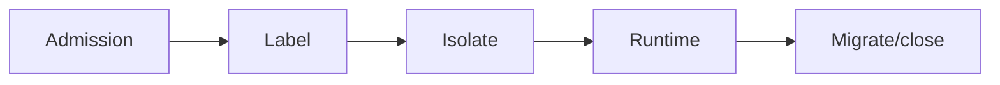

# BUILD-78 — Tenancy

> Source: [https://notion.so/4442fc733d6b4e188f2d82cfe8f48c8c](https://notion.so/4442fc733d6b4e188f2d82cfe8f48c8c)
> Created: 2026-04-20T18:37:00.000Z | Last edited: 2026-04-20T20:10:00.000Z


---
> **ℹ **Tier 15 · Multi-tenancy · Cross-scale · Priority: HIGH****

  Gives every scale a tenant dimension: swarms, memory cells, CRC balances, and ledgers are all tenant-scoped by construction.

## Fold Provenance

*[table: 2 columns]*

## Purpose

Avoid tenant-leak at any scale. Tenant is a first-class label stamped on every principal, resource, and record; isolation is schema-enforced, not policy-only.

## Dependencies

- **BUILD-23, BUILD-66, BUILD-87** (ancestors)
## File Structure

```javascript
crates/tenant-fabric/
├── src/
│   ├── label/
│   │   └── stamp.rs
│   ├── isolate/
│   │   ├── memory.rs
│   │   └── budget.rs
│   ├── fold/
│   │   ├── migrate.rs
│   │   └── close.rs
│   └── types.rs
```

## Interfaces & Types

```rust
pub struct TenantLabel { pub tenant: TenantId, pub tier: TenantTier, pub sovereignty: Region }
```

## Implementation SOP

1. Label everything at admission: principal, memory cell, CRC, program.
1. Enforce isolation at every scale boundary via capability graph.
1. Migrate/close: drain + export + purge.
## Acceptance Criteria

- [ ] No cross-tenant leaks in fuzz
- [ ] Isolation enforced at all scales
- [ ] Migrate preserves semantics
- [ ] Close leaves zero residue
- [ ] All tests pass with `vitest run`
- [ ] Tenant-aware dashboards
- [ ] Per-tenant billing hook
- [ ] Audit-ready exports
## Architecture



## Tier Matrix

*[table: 3 columns]*

## Extended Types

```rust
pub enum TenantTier { Bronze, Silver, Gold, Sovereign }
```

## Reference — Stamp

```rust
pub fn stamp<T: TenantLabeled>(obj: &mut T, t: &TenantLabel) { obj.set_label(t.clone()); }
```

## Observability

- `tenant.active` gauge, `tenant.leaks_total` counter
- `tenant.migrations_total`
## Security

- Labels immutable after stamp
- Cross-tenant calls require capability edge
## Failure Modes

*[table: 3 columns]*

## Operational Runbook

1. **Create:** `tenant create --tier gold`.
1. **Close:** `tenant close --id t --export s3://...`.
## Integration

- Consulted by every scale boundary
## FAQ

> **Can a Nano serve multiple tenants?** Only if Silver-tier and logically isolated; Gold+ require dedicated Nanos.

## Changelog

- v0.1.0 — label, isolate, migrate, close
- v0.2.0 (planned) — tenant-level encryption keys
- v0.3.0 (planned) — BYOK

