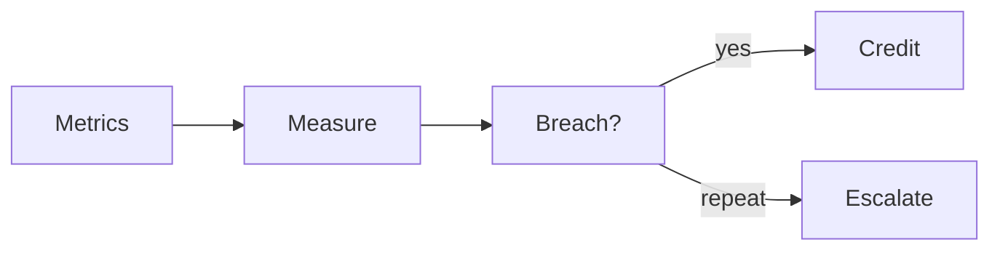

# BUILD-80 — SLA Engine

> Source: [https://notion.so/5d3a216d109b479db8c3238f5ff3c8fe](https://notion.so/5d3a216d109b479db8c3238f5ff3c8fe)
> Created: 2026-04-20T18:37:00.000Z | Last edited: 2026-04-20T20:11:00.000Z


---
> **ℹ **Tier 15 · Contracts · Cross-scale · Priority: HIGH****

  Machine-readable SLA/QoS contracts: targets, measurements, credits on breach. Enforced by Budget, observed by Oracle, breaches escalate via Quarantine.

## Fold Provenance

*[table: 2 columns]*

## Purpose

Turn verbal promises into verifiable code. Contracts drive alerts, credits, and dispatch priority.

## Dependencies

- **BUILD-60, BUILD-79, BUILD-89** (ancestors)
## File Structure

```javascript
crates/sla/
├── src/
│   ├── contract/
│   │   └── model.rs
│   ├── enforce/
│   │   ├── measure.rs
│   │   └── credit.rs
│   ├── fold/
│   │   └── escalate.rs
│   └── types.rs
```

## Interfaces & Types

```rust
pub struct Contract {
    pub tenant: TenantId,
    pub sku: String,
    pub targets: Vec<Target>,
    pub penalties: Vec<Penalty>,
}

pub struct Target { pub metric: String, pub op: Op, pub value: f64, pub window: Duration }
pub struct Penalty { pub on_breach: BreachAction, pub credit_pct: f32 }
```

## Implementation SOP

1. Measure: stream metrics; compute rolling windows.
1. Detect breach.
1. Credit: emit UsageLine adjustment.
1. Escalate if repeated breach.
## Acceptance Criteria

- [ ] Targets evaluable
- [ ] Breach detection ≤ window
- [ ] Credits reconcile
- [ ] Escalation correct
- [ ] All tests pass with `vitest run`
- [ ] Contract versioned
- [ ] Reports exportable
- [ ] Grace periods supported
## Architecture



## Penalty Table

*[table: 2 columns]*

## Extended Types

```rust
pub enum BreachAction { Credit, Boost, Quarantine, Notify }
```

## Reference — Tick

```rust
pub async fn tick(c: &Contract) {
    for t in &c.targets {
        if measure::breaches(t).await { enforce::apply_penalties(c).await; }
    }
}
```

## Observability

- `sla.breaches_total` by contract
- `sla.credits_total`
- `sla.compliance_pct` gauge
## Security

- Contract changes signed by both parties
## Failure Modes

*[table: 3 columns]*

## Operational Runbook

1. **Attach:** `sla attach --tenant t --file contract.json`.
1. **Report:** `sla report --tenant t`.
## Integration

- Metrics from Oracle; credits to Billing; escalation to Quarantine
## FAQ

> **Can tenants author their own contracts?** Yes — subject to admission validation.

## Changelog

- v0.1.0 — contracts, measure, credit, escalate
- v0.2.0 (planned) — predictive breach
- v0.3.0 (planned) — ML-negotiated contracts

