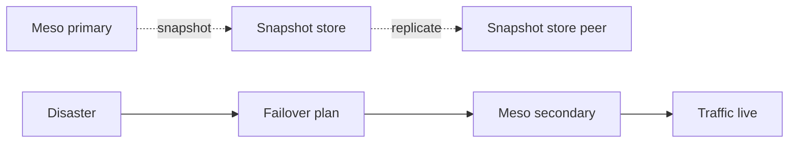

# BUILD-81 — Disaster Recovery

> Source: [https://notion.so/58cffde9d40b47408e39c16ed6bc1dad](https://notion.so/58cffde9d40b47408e39c16ed6bc1dad)
> Created: 2026-04-20T18:37:00.000Z | Last edited: 2026-04-20T20:11:00.000Z


---
> **ℹ **Tier 15 · DR · Cross-region · Priority: CRITICAL****

  The ritualized disaster-recovery sequence. Encodes drills, snapshots, restore points, RTO/RPO, and failover across Mesos.

## Fold Provenance

*[table: 2 columns]*

## Purpose

A disaster is defined in advance; the ritual is tested monthly. RTO ≤ 15 min, RPO ≤ 5 min for Gold tenants.

## Dependencies

- **BUILD-12, BUILD-17, BUILD-83** (ancestors)
## File Structure

```javascript
crates/dr-ritual/
├── src/
│   ├── snapshot/
│   │   ├── take.rs
│   │   └── verify.rs
│   ├── failover/
│   │   ├── plan.rs
│   │   └── execute.rs
│   ├── drill/
│   │   └── rehearse.rs
│   └── types.rs
```

## Interfaces & Types

```rust
pub struct RecoveryPoint { pub at: HLCTimestamp, pub mesos: Vec<MesoSwarmId>, pub verified: bool }
pub struct FailoverPlan { pub from: MesoSwarmId, pub to: MesoSwarmId, pub order: Vec<String> }
```

## Implementation SOP

1. Snapshot: every 5 min; verified via hash; replicated cross-region.
1. Failover: dry-run monthly; execute on breach.
1. Drill: quarterly full game-day.
## Acceptance Criteria

- [ ] Snapshot succeeds ≥ 99.9%
- [ ] Verify catches corruption
- [ ] Failover ≤ RTO
- [ ] Drill signed off quarterly
- [ ] All tests pass with `vitest run`
- [ ] RPO ≤ 5 min measured
- [ ] Post-drill blameless review
- [ ] Runbook up to date
## Architecture



## Tier RTO/RPO Matrix

*[table: 3 columns]*

## Extended Types

```rust
pub struct Drill { pub at: HLCTimestamp, pub scenario: String, pub outcome: String }
```

## Reference — Snapshot

```rust
pub async fn take() -> RecoveryPoint { snapshot::all_mesos().await }
```

## Observability

- `dr.snapshot_age_s` gauge, `dr.verify_failures_total`
- `dr.rto_actual_s`, `dr.rpo_actual_s`
- `dr.drill_success_total`
## Security

- Snapshots encrypted
- Failover requires dual-approval
- Drills ledger-recorded
## Failure Modes

*[table: 3 columns]*

## Operational Runbook

1. **Snapshot:** `dr snapshot --now`.
1. **Plan:** `dr plan --from m1 --to m2`.
1. **Execute:** `dr execute --plan <p> --confirm-code <c>`.
## Integration

- Triggers via Quarantine (Byzantine), Fortress (crit breach)
## FAQ

> **Can we failover partial traffic?** Yes — Conductor shifts subset first.

## Changelog

- v0.1.0 — snapshot, failover, drill
- v0.2.0 (planned) — cell-level failover
- v0.3.0 (planned) — automated chaos rehearsal

