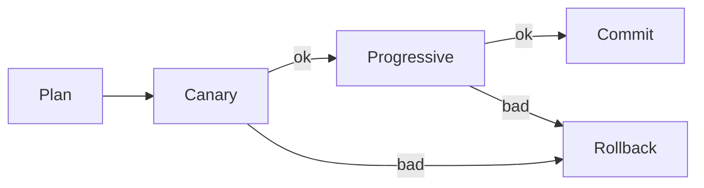

# BUILD-82 — Epoch Migration

> Source: [https://notion.so/9866a632f5844c4791f5003ddc2a46da](https://notion.so/9866a632f5844c4791f5003ddc2a46da)
> Created: 2026-04-20T18:37:00.000Z | Last edited: 2026-04-20T20:11:00.000Z


---
> **ℹ **Tier 15 · Rollout · Cross-scale · Priority: HIGH****

  Fleet-wide schema/genome/policy rollouts without downtime. Two-phase epoch transition with escape hatch.

## Fold Provenance

*[table: 2 columns]*

## Purpose

Upgrading genomes, policies, ISAs without interrupting service. Epochs make change observable and rollback-able.

## Dependencies

- **BUILD-50, BUILD-51, BUILD-82** (ancestors)
## File Structure

```javascript
crates/epoch/
├── src/
│   ├── plan/
│   │   └── delta.rs
│   ├── roll/
│   │   ├── canary.rs
│   │   ├── progressive.rs
│   │   └── rollback.rs
│   ├── fold/
│   │   └── commit.rs
│   └── types.rs
```

## Interfaces & Types

```rust
pub struct Epoch { pub id: u64, pub delta: EpochDelta, pub state: EpochState, pub owners: Vec<PrincipalId> }
pub enum EpochState { Proposed, Canary, Progressive, Committed, RolledBack }
```

## Implementation SOP

1. Plan: describe delta (genome/policy/ISA).
1. Canary: 1% fleet; observe targets.
1. Progressive: 10% → 50% → 100% with cool-down.
1. Commit or rollback.
## Acceptance Criteria

- [ ] Each stage gated
- [ ] Rollback ≤ RTO of tier
- [ ] Targets measured against Oracle
- [ ] Commit atomic per-Meso
- [ ] All tests pass with `vitest run`
- [ ] No dual-write bugs
- [ ] Fleet-wide dashboard
- [ ] Post-mortem template
## Architecture



## Stage Matrix

*[table: 3 columns]*

## Extended Types

```rust
pub struct EpochDelta { pub kind: String, pub payload: Bytes, pub compatibility: Compat }
pub enum Compat { Backward, Forward, Both, Breaking }
```

## Reference — Advance

```rust
pub async fn advance(e: &mut Epoch) -> Result<()> { roll::next_stage(e).await }
```

## Observability

- `epoch.stage_duration_s` histogram
- `epoch.rollbacks_total`
- `epoch.targets.delta` gauge
## Security

- Dual-approval for Breaking compat
- Ledger-audited
## Failure Modes

*[table: 3 columns]*

## Operational Runbook

1. **Plan:** `epoch plan --delta <f>`.
1. **Advance:** `epoch advance`.
1. **Rollback:** `epoch rollback`.
## Integration

- Uses Hot-Swap Evo path; Chrono-Sync coordinates timing
## FAQ

> **Can we skip canary?** Only emergency security patches; requires dual-approval.

## Changelog

- v0.1.0 — plan, canary, progressive, commit, rollback
- v0.2.0 (planned) — ML-guided soak
- v0.3.0 (planned) — cross-Meso coordinated epochs

