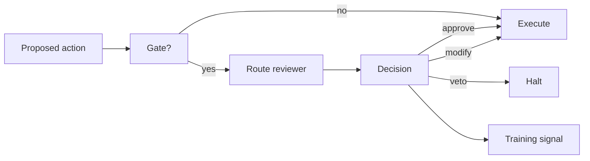

# BUILD-83 — HITL Gate

> Source: [https://notion.so/268d951cfc944f76988d7d111c799370](https://notion.so/268d951cfc944f76988d7d111c799370)
> Created: 2026-04-20T18:39:00.000Z | Last edited: 2026-04-20T20:11:00.000Z


---
> **ℹ **Tier 15 · HITL · Cross-scale · Priority: HIGH****

  Structured human review points across scales: approvals, vetoes, annotations, corrections. Every HITL event becomes training signal.

## Fold Provenance

*[table: 2 columns]*

## Purpose

Avoid two failure modes: (a) humans overwhelmed by approvals, (b) agents running unchecked. HITL Fabric gates only high-impact actions and routes them precisely.

## Dependencies

- **BUILD-37, BUILD-38, BUILD-87, BUILD-90** (ancestors)
## File Structure

```javascript
crates/hitl/
├── src/
│   ├── gate/
│   │   ├── policy.rs
│   │   └── route.rs
│   ├── inbox/
│   │   ├── queue.rs
│   │   └── sla.rs
│   ├── fold/
│   │   ├── annotate.rs
│   │   └── train.rs
│   └── types.rs
```

## Interfaces & Types

```rust
pub struct HITLRequest { pub principal: PrincipalId, pub action: String, pub context: Bytes, pub severity: Severity }
pub enum Decision { Approve, Veto, Modify(Bytes), Defer }
```

## Implementation SOP

1. Gate: policy decides whether HITL needed.
1. Route: to reviewer(s) based on capability & load.
1. Capture decision + rationale.
1. Feed into Continuum as training signal.
## Acceptance Criteria

- [ ] Gate decisions ≤ 10 ms
- [ ] Route honors capability
- [ ] SLA per severity
- [ ] Feedback loop closes to genome
- [ ] All tests pass with `vitest run`
- [ ] Reviewer workload balanced
- [ ] Offline review supported
- [ ] Mobile-friendly UI
## Architecture



## Severity Table

*[table: 3 columns]*

## Extended Types

```rust
pub struct Annotation { pub at: HLCTimestamp, pub by: PrincipalId, pub note: String }
```

## Reference — Gate

```rust
pub fn gate(r: &HITLRequest) -> bool { policy::requires_review(r) }
```

## Observability

- `hitl.requests_total` by severity
- `hitl.latency_s` histogram
- `hitl.approvals_total` / `vetoes_total`
## Security

- Reviewer identity verified (BUILD-87)
- Dual-sign for critical
- Decisions immutable in Provenance
## Failure Modes

*[table: 3 columns]*

## Operational Runbook

1. **Inbox:** `hitl inbox --user me`.
1. **Decide:** `hitl decide --id <r> --choice approve`.
1. **Audit:** `hitl audit --day today`.
## Integration

- Input from any scale; output to Continuum training
## FAQ

> **What if all reviewers are offline?** Request defaults to Defer or escalates per severity policy.

## Changelog

- v0.1.0 — gate, route, inbox, feedback
- v0.2.0 (planned) — async messaging integrations
- v0.3.0 (planned) — ML load-balancer

