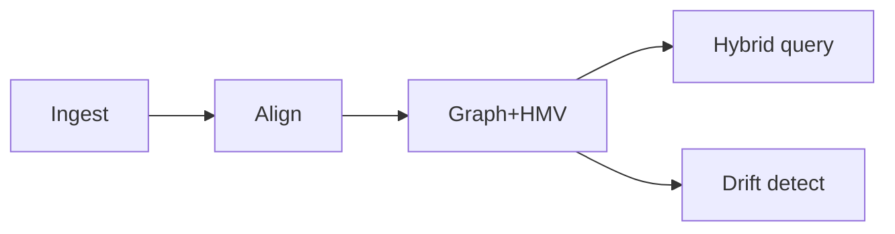

# BUILD-84 — Knowledge Graph Spine

> Source: [https://notion.so/77fdb5818da447cbb9dbf253293a7b9d](https://notion.so/77fdb5818da447cbb9dbf253293a7b9d)
> Created: 2026-04-20T18:39:00.000Z | Last edited: 2026-04-20T20:11:00.000Z


---
> **ℹ **Tier 15 · Knowledge · Cross-scale · Priority: HIGH****

  Unified KG across Meso. Nodes are concepts/entities/events; edges typed and provenance-linked; embeddings live alongside symbols.

## Fold Provenance

*[table: 2 columns]*

## Purpose

Bridge symbolic and sub-symbolic. Every concept has both a graph node and an HMV vector; provenance ensures factual traceability.

## Dependencies

- **BUILD-14, BUILD-90, BUILD-94** (ancestors)
## File Structure

```javascript
crates/kg-spine/
├── src/
│   ├── nodes/
│   │   ├── concept.rs
│   │   └── entity.rs
│   ├── edges/
│   │   ├── typed.rs
│   │   └── prov.rs
│   ├── fold/
│   │   ├── align.rs
│   │   └── drift.rs
│   └── types.rs
```

## Interfaces & Types

```rust
pub struct KGNode { pub id: NodeId, pub kind: NodeKind, pub vec: HmvVec, pub sources: Vec<ProvId> }
pub enum NodeKind { Concept, Entity, Event, Property }
```

## Implementation SOP

1. Ingest: extract nodes/edges with provenance.
1. Align: dedup via HMV similarity + string match.
1. Drift: detect concept drift; version nodes.
1. Query: hybrid graph+vector.
## Acceptance Criteria

- [ ] Alignment precision ≥ 0.95
- [ ] Hybrid query ≤ 50 ms
- [ ] Provenance per edge
- [ ] Drift versioning
- [ ] All tests pass with `vitest run`
- [ ] Scale-aware caching
- [ ] Tenant isolation
- [ ] SPARQL-like + vector API
## Architecture



## Edge Type Catalog

*[table: 3 columns]*

## Extended Types

```rust
pub struct Version { pub node: NodeId, pub v: u32, pub supersedes: Option<NodeId> }
```

## Reference — Query

```rust
pub async fn query(g: Gql, v: Option<HmvVec>) -> Vec<KGNode> { /* hybrid */ unimplemented!() }
```

## Observability

- `kg.nodes_total`, `kg.edges_total`
- `kg.query_ms` histogram
- `kg.drift_versions_total`
## Security

- Per-tenant slices
- Sensitive edges require capability
## Failure Modes

*[table: 3 columns]*

## Operational Runbook

1. **Query:** `kg query --gql "..." --vec ...`.
1. **Reconcile:** `kg reconcile --node <n>`.
## Integration

- Input: Perception Fabric (BUILD-103); consumer: L6 Planner, Agents
## FAQ

> **Can the KG be private per tenant?** Yes — partitions with explicit sharing edges.

## Changelog

- v0.1.0 — nodes, edges, hybrid query, drift
- v0.2.0 (planned) — temporal edges
- v0.3.0 (planned) — federated KG

