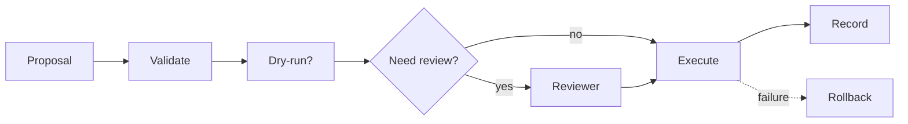

# BUILD-86 — Action Layer

> Source: [https://notion.so/f6dde2db6d1b49ef8aaa8929686155ce](https://notion.so/f6dde2db6d1b49ef8aaa8929686155ce)
> Created: 2026-04-20T18:39:00.000Z | Last edited: 2026-04-20T20:11:00.000Z


---
> **ℹ **Tier 15 · Actuation · Cross-scale · Priority: HIGH****

  The symmetric counterpart to Perception: agents propose actions; Action Fabric validates, gates, executes, logs.

## Fold Provenance

*[table: 2 columns]*

## Purpose

Every tool call becomes a typed, logged, reversible (where possible) action with explicit blast radius.

## Dependencies

- **BUILD-75, BUILD-89, BUILD-101** (ancestors)
## File Structure

```javascript
crates/action-fabric/
├── src/
│   ├── plan/
│   │   ├── propose.rs
│   │   └── validate.rs
│   ├── exec/
│   │   ├── run.rs
│   │   └── rollback.rs
│   ├── fold/
│   │   ├── dry_run.rs
│   │   └── record.rs
│   └── types.rs
```

## Interfaces & Types

```rust
pub struct Action { pub tool: String, pub args: Value, pub reversible: bool, pub blast_radius: Radius }
pub enum Radius { Self_, Tenant, Meso, External }
```

## Implementation SOP

1. Validate schema + capability.
1. Dry-run for high blast radius.
1. HITL gate if policy says so.
1. Execute; record.
1. Rollback path if reversible and failure.
## Acceptance Criteria

- [ ] Schema validation
- [ ] Dry-run faithful
- [ ] HITL integrated
- [ ] Rollback paths tested
- [ ] All tests pass with `vitest run`
- [ ] Provenance per action
- [ ] Idempotency keys
- [ ] Rate-limit per tenant
## Architecture



## Blast Radius Table

*[table: 2 columns]*

## Extended Types

```rust
pub struct Record { pub action: Action, pub result: ActionResult, pub at: HLCTimestamp }
pub enum ActionResult { Ok(Value), Err(String), RolledBack }
```

## Reference — Execute

```rust
pub async fn execute(a: Action) -> ActionResult { /* validate → gate → run → record */ unimplemented!() }
```

## Observability

- `action.runs_total` by tool
- `action.rollbacks_total`
- `action.blast_radius_mix` gauge
## Security

- Capability required per tool
- Rate-limit per tenant
- Audit immutable
## Failure Modes

*[table: 3 columns]*

## Operational Runbook

1. **Dry:** `act dry-run <action>`.
1. **Run:** `act run <action>`.
1. **Rollback:** `act rollback <record>`.
## Integration

- Called by Agent Runtimes; logs to Provenance
## FAQ

> **What about side effects outside the system?** Treated as External radius; always gated.

## Changelog

- v0.1.0 — validate, dry-run, execute, rollback
- v0.2.0 (planned) — transactional batches
- v0.3.0 (planned) — reversibility proofs

