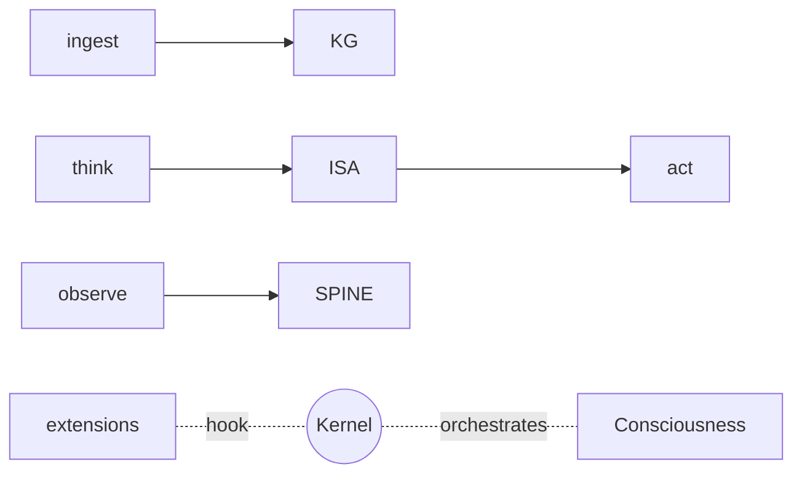

# BUILD-87 — Runtime Kernel

> Source: [https://notion.so/32ab5866f53240df98009086134e40eb](https://notion.so/32ab5866f53240df98009086134e40eb)
> Created: 2026-04-20T18:39:00.000Z | Last edited: 2026-04-20T20:11:00.000Z


---
> **ℹ **Tier 15 · Kernel · Master · Priority: CRITICAL****

  The master composition: binds Perception, KG, Memory, Action, Identity, Tenant, Budget, Scheduler, ISA, Lifecycle, Observability, Consciousness. Every other BUILD slots into the Kernel API.

## Fold Provenance

*[table: 2 columns]*

## Purpose

The Kernel is the stable contract between cognition and infrastructure. Third-party BUILDs (research ideas, vendor plugins) bind to the Kernel's 12 extension points.

## Dependencies

- **BUILD-78, BUILD-80, BUILD-82, BUILD-84, BUILD-86, BUILD-87, BUILD-94, BUILD-95, BUILD-96, BUILD-101, BUILD-102, BUILD-103, BUILD-104**
## File Structure

```javascript
crates/kernel/
├── src/
│   ├── api/
│   │   ├── ingest.rs
│   │   ├── think.rs
│   │   ├── act.rs
│   │   └── observe.rs
│   ├── extension/
│   │   ├── registry.rs
│   │   └── hook.rs
│   ├── fold/
│   │   ├── boot.rs
│   │   └── shutdown.rs
│   └── types.rs
```

## Interfaces & Types

```rust
pub trait Kernel {
    async fn ingest(&self, p: Perception) -> Result<()>;
    async fn think(&self, req: ThinkReq) -> Result<ThinkResp>;
    async fn act(&self, a: Action) -> Result<ActionResult>;
    async fn observe(&self, q: ObsQuery) -> Result<ObsResp>;
}
```

## Implementation SOP

1. **Boot**: initialize all fabrics; health-gate.
1. **Run**: expose the 4 verbs.
1. **Extension**: plug-ins register against hooks.
1. **Shutdown**: drain + snapshot + alignment check.
## Extension Points (12)

*[table: 3 columns]*

## Acceptance Criteria

- [ ] 4 API verbs implemented
- [ ] 12 hooks callable
- [ ] Boot ≤ 60 s; shutdown ≤ 30 s
- [ ] Health-gate strict
- [ ] Alignment check at shutdown
- [ ] All tests pass with `vitest run`
- [ ] Backwards compat policy
- [ ] SDK in 3 languages
## Architecture



## Extended Types

```rust
pub struct ThinkReq { pub goal: String, pub budget: Budget, pub deadline: Duration }
pub struct ThinkResp { pub plan: ProgramId, pub expected_outcome: String }
pub struct ObsQuery { pub kind: String, pub scope: Scope }
```

## Reference — Think

```rust
pub async fn think(req: ThinkReq) -> ThinkResp {
    let plan = l6::plan(&req).await;
    let isa = compile_isa(&plan);
    let assign = scheduler::dispatch(isa).await;
    ThinkResp { plan: assign.program, expected_outcome: "...".into() }
}
```

## Observability

- `kernel.api_calls_total` by verb
- `kernel.boot_duration_s`
- `kernel.extension_failures_total`
## Security

- Extensions capability-gated
- API calls tenant-scoped
- Kill-switch honored
## Failure Modes

*[table: 3 columns]*

## Operational Runbook

1. **Boot:** `kernel boot --config <f>`.
1. **Reload ext:** `kernel ext reload <name>`.
1. **Shutdown:** `kernel shutdown --graceful`.
## Integration

- THE binding point: every other BUILD plugs in here
## FAQ

> **Does the Kernel "think"?** No — it dispatches thinking to Agents; Kernel is pure orchestration + contract.

> **How stable is the API?** Semver-stable after v1.0; v0.x may break.

## Changelog

- v0.1.0 — 4 verbs, 12 hooks, boot/shutdown
- v0.2.0 (planned) — streaming API
- v0.3.0 (planned) — multi-language SDKs

