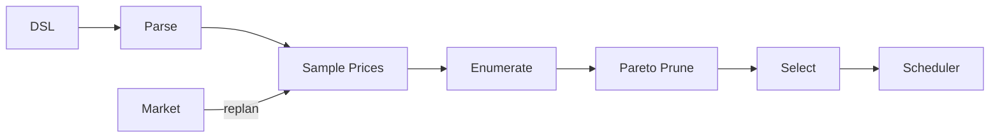

# BUILD-88 — Cost-Aware Compiler

> Source: [https://notion.so/78f974c4db7644ca9a1e9de9451f3909](https://notion.so/78f974c4db7644ca9a1e9de9451f3909)
> Created: 2026-04-20T18:49:00.000Z | Last edited: 2026-04-20T20:12:00.000Z


---
> **ℹ **Tier 16 · Compiler · Priority: HIGH****

  Compiles Swarm DSL programs to ISA with a per-op cost model fed by the Epistemic Market. The cheapest correct plan wins; fallbacks are priced and ranked.

## Fold Provenance

*[table: 4 columns]*

## Purpose

Turn a goal into an executable plan with cost and fitness priced in. Replan when market prices shift beyond threshold. The scheduler gets annotated ops, not raw DSL.

## Dependencies

- **BUILD-84, BUILD-88, BUILD-80** (ancestors)
- BUILD-91 Swarm DSL, BUILD-60 Oracle Fitness
## File Structure

```javascript
crates/cost-compiler/
├── src/
│   ├── parse/
│   ├── cost/
│   │   ├── model.rs
│   │   └── sample.rs
│   ├── plan/
│   │   ├── enumerate.rs
│   │   ├── prune.rs
│   │   └── select.rs
│   └── types.rs
```

## Interfaces & Types

```rust
pub struct CostedOp { pub op: Op, pub cost: Crc, pub fitness: f32, pub latency_ms: u32 }
pub struct Plan { pub ops: Vec<CostedOp>, pub total_cost: Crc, pub p95_latency_ms: u32 }
```

## Implementation SOP

1. Parse DSL → op graph
1. Sample market prices per op
1. Enumerate feasible plans (beam search, width=k)
1. Prune by cost + fitness pareto
1. Select plan; emit to scheduler
1. Recompile if market moves > δ during execution
## Acceptance Criteria

- [ ] Plan selected ≤ 100ms for 50-op graph
- [ ] Replan triggered on δ ≥ 20% price move
- [ ] Pareto front preserved
- [ ] All tests pass with `vitest run`
- [ ] Cost within 15% of realized
- [ ] Fallback plans ranked
- [ ] No unbounded enumeration
- [ ] Deterministic with fixed seed
## Architecture



## Cost Dimensions

*[table: 3 columns]*

## Extended Types

```rust
pub struct ParetoFront { pub frontier: Vec<Plan> }
```

## Reference — Compile

```rust
pub fn compile(dsl: &str) -> Result<Plan> {
    let g = parse(dsl)?;
    let prices = market::sample(&g.ops)?;
    let plans = enumerate::beam(&g, &prices, 16);
    let front = prune::pareto(plans);
    select::best(front)
}
```

## Observability

- `compiler.plans_selected_total`
- `compiler.replans_total`
- `compiler.plan_cost_error_histogram`
## Security

- Plans signed; scheduler verifies
- Market oracle tamper check
## Failure Modes

*[table: 6 columns]*

## Operational Runbook

1. **Compile:** `cc plan <file.dsl>`
1. **Recost:** `cc recost <plan-id>`
1. **Explain:** `cc why <plan-id>`
## Integration

- Consumes BUILD-88 market prices
- Produces plans for BUILD-80 scheduler
- Traces to BUILD-90 Provenance
## FAQ

> **Global optimum guaranteed?** No, beam search finds near-optimal with bounded cost.

## Changelog

- v0.1.0 — beam + pareto
- v0.2.0 (planned) — RL-based selection
- v0.3.0 (planned) — multi-objective lexicographic modes

