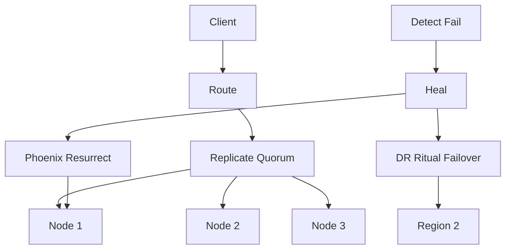

# BUILD-89 — Self-Healing Data Plane

> Source: [https://notion.so/b6b606ed567046ffab6bd226e7dfbeb6](https://notion.so/b6b606ed567046ffab6bd226e7dfbeb6)
> Created: 2026-04-20T18:49:00.000Z | Last edited: 2026-04-20T20:12:00.000Z


---
> **ℹ **Tier 16 · Infra · Priority: HIGH****

  Unified data plane that heals transport, compute, and storage failures transparently. Combines Exo Transport's routing with Phoenix Prime's resurrection and DR Ritual's regional failover.

## Fold Provenance

*[table: 4 columns]*

## Purpose

A client writes to any endpoint; the data plane routes, replicates, heals, and fails over without client-visible errors. 99.9999% availability target.

## Dependencies

- **BUILD-63, BUILD-61, BUILD-99** (ancestors)
- BUILD-50 Chrono-Sync, BUILD-53 Exo-RDMA
## File Structure

```javascript
crates/dp/
├── src/
│   ├── route/
│   │   ├── pick.rs
│   │   └── fallback.rs
│   ├── heal/
│   │   ├── detect.rs
│   │   ├── resurrect.rs
│   │   └── failover.rs
│   ├── replicate/
│   │   └── quorum.rs
│   └── types.rs
```

## Interfaces & Types

```rust
pub struct Write { pub key: Vec<u8>, pub val: Vec<u8>, pub consistency: Cons }
pub enum Cons { One, Quorum, All, Strong }
pub struct HealReport { pub event: HealEvent, pub latency_ms: u32, pub scope: HealScope }
```

## Implementation SOP

1. Route write to preferred region + replica quorum
1. Detect failure via Exo probes
1. Phoenix resurrect < 50ms for node failures
1. Regional failover via DR Ritual for region loss
1. Repair replicas asynchronously
1. Report healing to Observability
## Acceptance Criteria

- [ ] p99.9 write latency ≤ 50ms healthy
- [ ] Heal time ≤ 50ms for node failure
- [ ] Regional failover ≤ 5s
- [ ] Zero data loss at Strong consistency
- [ ] All tests pass with `vitest run`
- [ ] Client sees no errors for tolerated failures
- [ ] Replica drift ≤ 100ms eventually
- [ ] Chaos test passes (node + region + transport)
## Architecture



## Consistency Levels

*[table: 3 columns]*

## Extended Types

```rust
pub enum HealEvent { NodeDown(NodeId), PartitionDetected, RegionLoss(RegionId) }
pub enum HealScope { Local, Regional, Global }
```

## Reference — Write

```rust
pub async fn write(w: Write) -> Result<()> {
    let route = route::pick(&w).await?;
    match replicate::quorum(&route, &w).await {
        Ok(_) => Ok(()),
        Err(e) => { heal::react(e).await?; replicate::quorum(&route, &w).await }
    }
}
```

## Observability

- `dp.writes_total{consistency}`
- `dp.heal_events_total{scope}`
- `dp.region_failovers_total`
## Security

- All inter-node traffic mTLS
- Quorum validates signatures before ack
- Region failover signed by DR council
## Failure Modes

*[table: 6 columns]*

## Operational Runbook

1. **Probe:** `dp probe --region us-west`
1. **Force failover:** `dp failover --region us-west --to us-east`
1. **Repair:** `dp repair --drift-gt 100ms`
## Integration

- Primary write surface for BUILD-14 HMV, BUILD-102 KG Spine
- Escalates to BUILD-28 Incidents on region loss
## FAQ

> **Is this Paxos?** No, it's CPWBFT + Exo routing. Paxos is one of the acceptable consensus backends under Strong consistency.

## Changelog

- v0.1.0 — route/replicate/heal/failover
- v0.2.0 (planned) — automatic consistency level tuning
- v0.3.0 (planned) — sub-ms heal for critical paths

