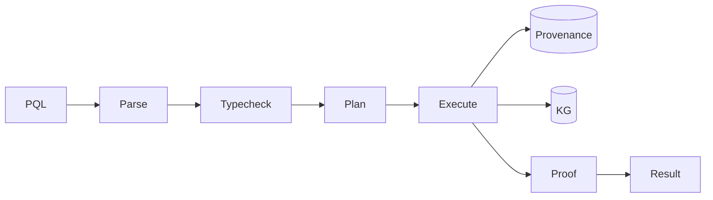

# BUILD-90 — Provenance Query Language

> Source: [https://notion.so/7263edeb12ac4b5f8c80024118ac2d6d](https://notion.so/7263edeb12ac4b5f8c80024118ac2d6d)
> Created: 2026-04-20T18:51:00.000Z | Last edited: 2026-04-20T20:12:00.000Z


---
> **ℹ **Tier 16 · Query · Priority: MEDIUM****

  Typed query language for interrogating the Provenance Ledger joined with the Knowledge Graph Spine. Answers questions like "what decided this weight?" or "who touched tenant X data in the last hour?"

## Fold Provenance

*[table: 4 columns]*

## Purpose

Typesafe, auditable provenance queries. Query plans cached and verified; results come with cryptographic proofs of completeness.

## Dependencies

- **BUILD-90, BUILD-102, BUILD-84** (ancestors)
- BUILD-87 Identity Graph (for authz)
## File Structure

```javascript
crates/pql/
├── src/
│   ├── parse/
│   ├── typecheck/
│   ├── plan/
│   ├── execute/
│   │   ├── scan.rs
│   │   ├── join.rs
│   │   └── proof.rs
│   └── types.rs
```

## Interfaces & Types

```rust
pub struct Query { pub text: String, pub bindings: HashMap<String, Value> }
pub struct Result { pub rows: Vec<Row>, pub proof: CompletenessProof }
```

## Implementation SOP

1. Parse PQL → AST
1. Typecheck against ISA op schema
1. Plan: join Provenance + KG; choose index paths
1. Execute: scan/filter/join with bounded cost
1. Emit completeness proof (Merkle + bloom)
1. Authz check per row
## Acceptance Criteria

- [ ] Typesafe queries
- [ ] Completeness proof verifies
- [ ] P95 latency ≤ 200ms for typical query
- [ ] All tests pass with `vitest run`
- [ ] Authz blocks unauthorized rows
- [ ] Deterministic ordering
- [ ] Explain plan available
- [ ] SQL interop for read-only joins
## Architecture



## Example Queries

*[table: 2 columns]*

## Extended Types

```rust
pub struct CompletenessProof { pub merkle_root: [u8; 32], pub bloom: Bloom, pub range: (u64, u64) }
```

## Reference — Execute

```rust
pub async fn execute(q: Query, actor: ActorId) -> Result<Vec<Row>> {
    let ast = parse(&q.text)?;
    let typed = typecheck(ast)?;
    let plan = plan::build(typed)?;
    let rows = execute::run(plan).await?;
    authz::filter(rows, actor).await
}
```

## Observability

- `pql.queries_total`
- `pql.proof_failures_total`
- `pql.p95_latency_ms`
## Security

- Per-row authz via capability tokens
- Query bounded cost to prevent DoS
- Audit trail of queries
## Failure Modes

*[table: 6 columns]*

## Operational Runbook

1. **Query:** `pql run <file.pql>`
1. **Explain:** `pql explain <file.pql>`
1. **Reindex:** `pql reindex provenance`
## Integration

- Used by Council motions (BUILD-122)
- Exported to SIEM via adapter
## FAQ

> **Is this SQL?** No, but SQL-read views are exposed for ecosystem tools.

## Changelog

- v0.1.0 — parse/plan/execute/proof
- v0.2.0 (planned) — streaming results
- v0.3.0 (planned) — federated across tenants (with zk proofs)

