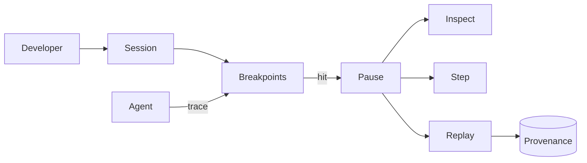

# BUILD-91 — Cognitive Debugger

> Source: [https://notion.so/aa6c5fe1c6834470892ab420ffb58cd4](https://notion.so/aa6c5fe1c6834470892ab420ffb58cd4)
> Created: 2026-04-20T18:51:00.000Z | Last edited: 2026-04-20T20:12:00.000Z


---
> **ℹ **Tier 16 · Tooling · Priority: HIGH****

  Step-debugger for swarm cognition. Set breakpoints on belief changes, fitness drops, or ISA traces. Time-travel to any past Frame via Consciousness replay.

## Fold Provenance

*[table: 4 columns]*

## Purpose

Real developer experience for agent systems: pause, inspect, replay, and modify. Makes swarm behavior tractable.

## Dependencies

- **BUILD-86, BUILD-95, BUILD-84** (ancestors)
- BUILD-90 Provenance, BUILD-29 Morphic UI
## File Structure

```javascript
crates/cog-debug/
├── src/
│   ├── breakpoint/
│   ├── inspect/
│   ├── replay/
│   ├── step/
│   └── types.rs
packages/cog-debug-ui/
```

## Interfaces & Types

```rust
pub enum Breakpoint { OnBelief(Predicate), OnFitnessDrop(f32), OnIsaOp(Op), OnFrame(FrameFilter) }
pub struct Session { pub agent: AgentId, pub breakpoints: Vec<Breakpoint>, pub cursor: HlcTs }
```

## Implementation SOP

1. Attach session to agent via capability token
1. Tap ISA trace + Frame stream
1. Evaluate breakpoints in-band; pause on hit
1. Inspect: agent state, Frame, local ISA log
1. Step: atomic op / Frame / Tick
1. Replay: rewind cursor; rehydrate from Provenance
## Acceptance Criteria

- [ ] Breakpoint accuracy 100% on ISA ops
- [ ] Replay bit-exact for deterministic paths
- [ ] P95 pause latency ≤ 10ms
- [ ] All tests pass with `vitest run`
- [ ] Non-blocking inspect (read-only safe)
- [ ] Mutation requires council token
- [ ] UI renders 100+ frames/s
- [ ] Session drains cleanly
## Architecture



## Inspect Surfaces

*[table: 4 columns]*

## Extended Types

```rust
pub struct StepResult { pub ops_advanced: u32, pub frames_advanced: u32, pub halted: bool }
```

## Reference — Step

```rust
pub async fn step(s: &mut Session, n: u32) -> Result<StepResult> {
    let advanced = isa::advance(s.agent, n).await?;
    Ok(StepResult { ops_advanced: advanced, frames_advanced: 0, halted: false })
}
```

## Observability

- `cog_debug.sessions_active`
- `cog_debug.breakpoint_hits_total`
- `cog_debug.replay_requests_total`
## Security

- Session bound to developer identity
- Mutation of live agents gated by Council
- Inspect of tenant data requires capability
## Failure Modes

*[table: 6 columns]*

## Operational Runbook

1. **Attach:** `cogdbg attach <agent>`
1. **Break:** `cogdbg break --on-fitness-drop 0.05`
1. **Replay:** `cogdbg replay --ts 2026-04-20T10:00Z`
## Integration

- Reads from BUILD-86 OTel, BUILD-90 Provenance
- UI embedded in BUILD-29 Morphic
## FAQ

> **Can this debug prod?** Read-only yes; mutations require Continuity Council approval.

## Changelog

- v0.1.0 — breakpoints, inspect, step, replay
- v0.2.0 (planned) — speculative what-if replay
- v0.3.0 (planned) — collaborative multi-dev sessions

