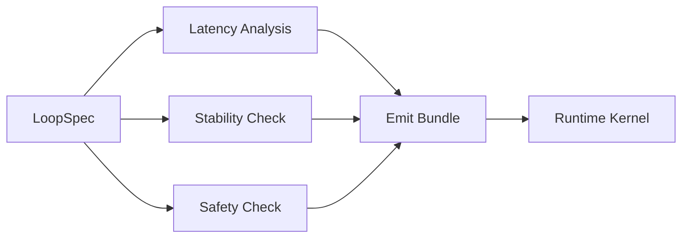

# BUILD-92 — Perception-Action Loop Compiler

> Source: [https://notion.so/c53d360cbbff4fdc9f8e08428d439439](https://notion.so/c53d360cbbff4fdc9f8e08428d439439)
> Created: 2026-04-20T18:51:00.000Z | Last edited: 2026-04-20T20:12:00.000Z


---
> **ℹ **Tier 16 · Compiler · Priority: HIGH****

  Compiles closed-loop perception → cognition → action pipelines with end-to-end latency guarantees. Validates loops are stable under the runtime kernel's scheduling.

## Fold Provenance

*[table: 4 columns]*

## Purpose

Express full cognition loops as a single artifact with compile-time latency, stability, and safety proofs.

## Dependencies

- **BUILD-103, BUILD-104, BUILD-105** (ancestors)
- BUILD-120 Cost Compiler, BUILD-124 PQL
## File Structure

```javascript
crates/pal-compiler/
├── src/
│   ├── spec/
│   ├── stability/
│   ├── latency/
│   ├── emit/
│   └── types.rs
```

## Interfaces & Types

```rust
pub struct LoopSpec {
    pub perceive: Vec<Op>,
    pub think: Vec<Op>,
    pub act: Vec<Op>,
    pub loop_rate_hz: u32,
    pub latency_budget_ms: u32,
}
```

## Implementation SOP

1. Parse loop spec → 3-phase graph
1. Latency analysis: sum per-phase p99 ≤ budget
1. Stability check: Lyapunov or bounded-state proof
1. Safety: action guards present for every effect
1. Emit runtime-kernel schedulable bundle
1. Register with Runtime Kernel
## Acceptance Criteria

- [ ] p99 loop latency ≤ budget in prod
- [ ] Loop stable under chaos injection
- [ ] Safety guards cover all effects
- [ ] All tests pass with `vitest run`
- [ ] Compile ≤ 5s for 100-op loop
- [ ] Re-emits on dependency change
- [ ] Deterministic under fixed seed
- [ ] Explain output mountable in debugger
## Architecture



## Loop Phases

*[table: 6 columns]*

## Extended Types

```rust
pub struct StabilityProof { pub method: StabilityMethod, pub bound: f32 }
pub enum StabilityMethod { Lyapunov, BoundedState, Simulated }
```

## Reference — Compile

```rust
pub fn compile(s: LoopSpec) -> Result<LoopBundle> {
    latency::check(&s)?;
    stability::prove(&s)?;
    safety::validate(&s)?;
    emit::bundle(s)
}
```

## Observability

- `pal_compiler.compiles_total`
- `pal_compiler.stability_failures_total`
- `pal_compiler.latency_overruns_total`
## Security

- Bundle signed by compiler identity
- Kernel verifies signature before dispatch
- Safety guards executable-in-trust-zone
## Failure Modes

*[table: 6 columns]*

## Operational Runbook

1. **Compile:** `palc build <loop.yaml>`
1. **Dry-run:** `palc run --ghost <bundle>`
1. **Deploy:** `palc deploy <bundle>`
## Integration

- Consumes BUILD-103 perception, BUILD-104 action
- Deploys to BUILD-105 Runtime Kernel
- Debuggable via BUILD-125
## FAQ

> **Can think phase be unbounded?** No, or stability cannot be proven. Hard cap required.

## Changelog

- v0.1.0 — latency/stability/safety/emit
- v0.2.0 (planned) — stochastic stability proofs
- v0.3.0 (planned) — adaptive rate control

