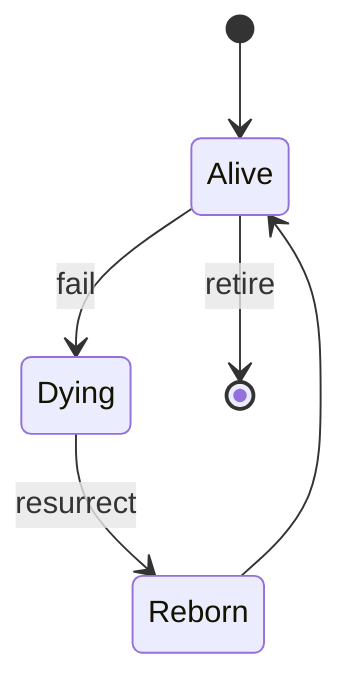

# BUILD-93 — Phoenix Prime (Meta-Resurrection)

> Source: [https://notion.so/6277680dc4ec4d81a16fdef4879478ba](https://notion.so/6277680dc4ec4d81a16fdef4879478ba)
> Created: 2026-04-20T16:02:00.000Z | Last edited: 2026-04-20T20:09:00.000Z


---
> **ℹ **Tier 11 · Synthesis · Priority: HIGH****

  Fold of BUILD-12 (Phoenix), BUILD-51 (HOT_SWAP_EVO), and BUILD-17 (Immortality Protocol). Unified resurrection semantics: any failed entity can be reborn with preserved identity, hot-swapped-in, and declared immortal by protocol.

## Fold Provenance

*[table: 2 columns]*

## Purpose

Phoenix Prime makes death reversible. When an agent, engine, or service fails, its **identity** (Immortality) is preserved, a **replacement** is hot-swapped (HOT_SWAP_EVO) into its address, and its **state** is reconstructed (Phoenix). Consumers observe a blip, not a death.

## Dependencies

- **BUILD-12, BUILD-51, BUILD-17** (ancestors)
- **BUILD-56 (Genesis)** — replacement genome
- **BUILD-50 (Chrono-Sync)** — resurrection event ordering
## File Structure

```javascript
crates/phoenix-prime/
├── src/
│   ├── detect/
│   │   ├── liveness.rs
│   │   └── coma.rs           # live-but-degraded
│   ├── resurrect/
│   │   ├── identity.rs       # Immortality claim
│   │   ├── state.rs          # Phoenix reconstruction
│   │   └── swap.rs           # HOT_SWAP_EVO substitution
│   ├── fold/
│   │   ├── seamless.rs       # consumer transparency
│   │   └── memory.rs         # lifelong identity ledger
│   └── types.rs
```

## Interfaces & Types

```rust
pub struct Death {
    pub entity: Uuid,
    pub cause: Cause,
    pub at: HLCTimestamp,
    pub last_known_state: StateDigest,
}

pub enum Cause { Crash, Timeout, PolicyKill, HardwareFail, AdversarialKill }

pub struct Resurrection {
    pub original: Uuid,
    pub new_body: Uuid,
    pub identity: Identity,
    pub state_recovered: f64,     // [0,1]
    pub swap_duration_us: u64,
}

pub struct Identity {
    pub canonical: Uuid,          // survives resurrection
    pub generation: u32,
    pub memory: MemoryDigest,
}
```

## Implementation SOP

### Step 1: Detect death (`detect/`)

- Liveness probe + coma detector (live but degraded)
- Emit `Death` event with last known state
### Step 2: Resurrect identity (`resurrect/identity.rs`)

- Pull canonical Identity from Immortality ledger
- Increment generation; keep canonical UUID
### Step 3: Reconstruct state (`resurrect/state.rs`)

- Phoenix: event-sourced replay from last snapshot
- Validate against digest
### Step 4: Hot-swap body (`resurrect/swap.rs`)

- HOT_SWAP_EVO atomic substitution
- Consumer addresses unchanged (Conductor address stable)
### Step 5: Seamless (`fold/seamless.rs`)

- Freeze incoming requests briefly (< FRACTAL_HALT)
- Drain in-flight; swap; resume
- Consumers see latency blip, not failure
## Acceptance Criteria

- [ ] Death detected within 1 s
- [ ] Identity preserved across resurrections
- [ ] State recovery ≥ 99% for well-checkpointed entities
- [ ] Hot-swap ≤ 112 μs
- [ ] Consumer-visible failure rate ≤ 0.1%
- [ ] All tests pass with `vitest run`
- [ ] Lineage ledger tamper-evident
- [ ] Generation counter monotone across deaths
## Architecture



## Cause → Strategy Table

*[table: 4 columns]*

## Extended Types

```rust
pub struct Ledger { pub entries: Vec<LedgerEntry>, pub merkle_root: [u8;32] }
pub struct LedgerEntry { pub id: Uuid, pub gen: u32, pub at: HLCTimestamp, pub cause: Cause }
```

## Reference — Resurrect

```rust
pub async fn resurrect(d: Death) -> Result<Resurrection> {
    let ident = identity::claim(d.entity).await?;
    let new_id = genesis::spawn(&ident).await?;
    let state_cov = state::reconstruct(new_id, &d.last_known_state).await?;
    let swap_us = swap::atomic(d.entity, new_id).await?;
    Ok(Resurrection { original: d.entity, new_body: new_id, identity: ident, state_recovered: state_cov, swap_duration_us: swap_us })
}
```

## Observability

- `phoenix.deaths_total`, label `cause`
- `phoenix.resurrection.latency_ms`
- `phoenix.state_recovered.pct` histogram
- `phoenix.generation.current` gauge
## Security

- Adversarial kills never auto-resurrect
- Identity ledger Merkle-signed
- Generation skip detected
- Tombstones final (Immortality excepted)
## Failure Modes

*[table: 3 columns]*

## Operational Runbook

1. **Declare dead:** `phoenix kill --entity <uuid> --cause PolicyKill`.
1. **Resurrect:** `phoenix resurrect --entity <uuid>`.
1. **Ledger audit:** `phoenix ledger verify`.
## Integration

- **BUILD-56 Genesis:** new body source
- **BUILD-58 Immune:** adversarial kill gate
- **BUILD-59 Conductor:** stable addresses
## FAQ

> **Is this idempotent?** Resurrection is — repeated calls converge on single generation bump.

> **What if identity is corrupted?** Rebuild from Merkle proofs + last signed generation.

## Changelog

- v0.1.0 — detect, resurrect, seamless swap, ledger
- v0.2.0 (planned) — cross-region resurrection
- v0.3.0 (planned) — predictive resurrection (pre-spawn on risk signal)

